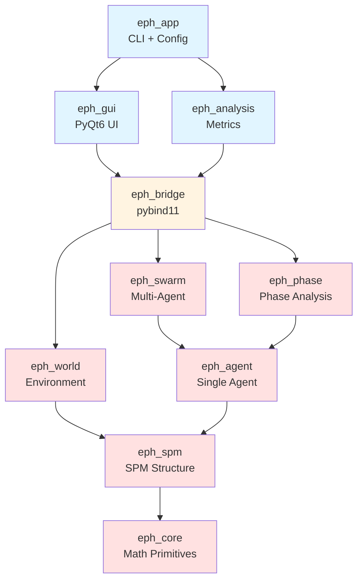

# EPH v2.1 プロジェクト概要

**最終更新**: 2026-02-02

## このドキュメントの目的

AIエージェント（Claude Code）がプロジェクト全体像を迅速に把握するための最初の読み込みファイル。CLAUDE.mdの軽量版として、主要概念とアーキテクチャの骨格を提供します。

**対象読者**: AIエージェント、新規参加者、プロジェクトレビュアー

---

## プロジェクト概要

EPH (Expected-Free-Energy-based Perceptual Haze) v2.1は、**Free Energy Principleに基づく群知能制御の理論研究フレームワーク**です。

### 中心的主張

> **Markov Blanket破れ強度 β の臨界点 β_c において、群の環境適応性が最大化される**

これは「カオスの縁（Edge of Chaos）」で適応性が最大になるという直感を、定量的に裏付ける初の理論的結果です。

### 主要な3つの貢献

1. **Theorem 1（適応性最大化定理）**: 応答関数 χ(β) が臨界点 β_c で最大
2. **Theorem 2（臨界点公式）**: β_c = (1/τ_haze - h̄(1-h̄)κηL_f²) / 2(z-1) の解析解
3. **能動的臨界制御**: hazeを介してβを制御可能にする実装方法の提案

---

## 主要概念（クイックリファレンス）

| 記号 | 名称 | 意味 | 典型値 |
|------|------|------|--------|
| **β** | MB breaking strength | Markov Blanket破れ強度 | 0.098 (臨界点) |
| **κ** | Haze sensitivity | ヘイズ感度（個体差） | 0.3 (Leader) ~ 1.5 (Reserve) |
| **h** | Haze | 知覚的曖昧性のフィールド | [0, 1] |
| **χ(β)** | Susceptibility | 応答関数（環境変化への感度） | β_c で最大 |
| **φ(β)** | Order parameter | 秩序パラメータ（haze不均一性） | β < β_c: 0, β > β_c: >0 |
| **SPM** | Saliency Polar Map | 自己中心極座標マップ（10×12×12） | - |

詳細は `.claude/00_project/glossary.md` を参照。

---

## パッケージ階層構造



**凡例**:
- 青: Python層（Layer 5-6）
- オレンジ: ブリッジ層（Layer 4）
- 赤: C++コア層（Layer 0-3）

---

## 開発アーキテクチャ

### 技術スタック

**C++ Core**:
- **Eigen 3.4+**: テンソル/行列演算
- **pybind11 2.11+**: Python連携
- **CMake 3.20+**: ビルドシステム
- **GoogleTest**: 単体テスト

**Python Layer**:
- **PyQt6**: GUI
- **NumPy/SciPy**: 数値解析
- **Matplotlib**: 可視化
- **pytest**: テスト

### 設計原則

1. **階層的パッケージ構造**: 下位層は上位層に依存しない
2. **各層が独立テスト可能**: モックで依存を切り離し
3. **理論とコードの対応**: `theory_to_code/` で数式→実装を明示
4. **段階的実装**: Phase 1-6で検証目標を1つずつクリア

---

## 開発フェーズ（Phase 1-6）

| Phase | 期間 | 目標 | 主要パッケージ |
|-------|------|------|---------------|
| **Phase 1** | Week 1-2 | 基盤構築 | eph_core + eph_spm |
| **Phase 2** | Week 3 | 単体エージェント | eph_agent（hazeのみ） |
| **Phase 3** | Week 4 | 相転移検出（V2） | eph_swarm + eph_phase |
| **Phase 4** | Week 5 | Python統合 | eph_bridge + eph_gui |
| **Phase 5** | Week 6-7 | 行為更新（V4/V5） | eph_agent（action追加） |
| **Phase 6** | Week 8-10 | 完全検証（V1-V5） | eph_world + eph_analysis |

詳細は `.claude/00_project/phases.md` を参照。

---

## 検証目標（V1-V5）

| ID | 目標 | 成功基準 | 実装Phase |
|----|------|---------|----------|
| **V1** | β_c パラメータ依存性 | 理論値±10%以内 | Phase 3 |
| **V2** | 相転移検出 | φ(β) の明確な不連続 | **Phase 3** ⭐ |
| **V3** | 2:6:2 最適性 | F_swarm(2:6:2) < その他 | Phase 5 |
| **V4** | Lyapunov descent | V[k+1] ≤ V[k] | Phase 5 |
| **V5** | 収束率 | ρ_emp ∈ [0.01, 0.03] | Phase 5 |

詳細は `doc/appendix/EPH-2.1_appendix-C_validation.md` を参照。

---

## 主要実装ノート

### Critical: stop_gradient on Haze

**絶対に守るべきルール**:
```cpp
// NG: hazeで微分してしまう
auto gate = (1 - R1) * F4 * (1 - kappa * haze);

// OK: hazeの値のみ使用（勾配追跡なし）
auto haze_value = haze.eval();  // .eval()でコピー
auto gate = (1 - R1) * F4 * (1 - kappa * haze_value);
```

これを守らないと「haze collapse」（全エージェントのhaze → 0 or 1）が発生します。

### Boundary Conditions

- **θ方向（角度）**: 周期境界（wrap with mod 12）
- **r方向（距離）**: Neumann境界（ゼロ勾配、b=0 と b=11 で反射）

### Time Scale Separation

τ_θ ≫ τ_h ≫ τ_u を維持:
- 予測器 f_θ: ~100ステップごと更新
- Haze h: EMA（τ_EMA ≥ 1.0s）
- Action u: 毎ステップ更新

---

## ドキュメント体系

### すぐに読むべきドキュメント

**セットアップ**:
- `.claude/04_onboarding/quickstart.md` - 30分で環境構築
- `.claude/00_project/glossary.md` - 用語集

**実装開始前**:
- `.claude/01_development_docs/cpp_guidelines/coding_style.md` - 命名規則
- `.claude/01_development_docs/package_specs/eph_core.md` - Layer 0仕様

**理論の詳細**:
- `doc/EPH-2.1_main.md` - 研究提案書（メイン）
- `doc/appendix/EPH-2.1_appendix-A_proofs.md` - 数学的証明
- `doc/appendix/EPH-2.1_appendix-B_spm.md` - SPM完全仕様

### Phase別に読むドキュメント

各Phaseの開始時に `.claude/01_development_docs/package_specs/` から該当パッケージのドキュメントを読み込んでください。

---

## クイックスタート（30秒版）

```bash
# 1. リポジトリクローン（または移動）
cd /path/to/eph-project

# 2. 環境構築（詳細は quickstart.md）
# - CMake 3.20+
# - Eigen 3.4+
# - pybind11 2.11+
# - Python 3.9+ (NumPy, PyQt6)

# 3. ビルド（Phase 1以降）
cmake -B build -S . && cmake --build build

# 4. テスト実行
cd build && ctest

# 5. GUI起動（Phase 4以降）
python -m eph_app gui
```

詳細は `.claude/04_onboarding/quickstart.md` を参照。

---

## トラブル時の対処

問題が発生した場合は `.claude/05_troubleshooting/` を確認:

- **ビルドエラー**: `common_errors.md`
- **Haze崩壊**: `haze_collapse.md`
- **相転移検出失敗**: `phase_transition_debug.md`
- **NaN/Inf発生**: `numerical_instability.md`
- **Python連携クラッシュ**: `binding_crashes.md`

---

## 関連ドキュメント

- **完全版アーキテクチャ**: `CLAUDE.md`
- **理論的背景**: `doc/EPH-2.1_main.md`
- **開発Phase詳細**: `.claude/00_project/phases.md`
- **用語集**: `.claude/00_project/glossary.md`
- **パッケージ仕様**: `.claude/01_development_docs/package_specs/`

---

*このドキュメントは、プロジェクト全体の「地図」として機能します。*
*詳細な実装は各専門ドキュメントを参照してください。*
