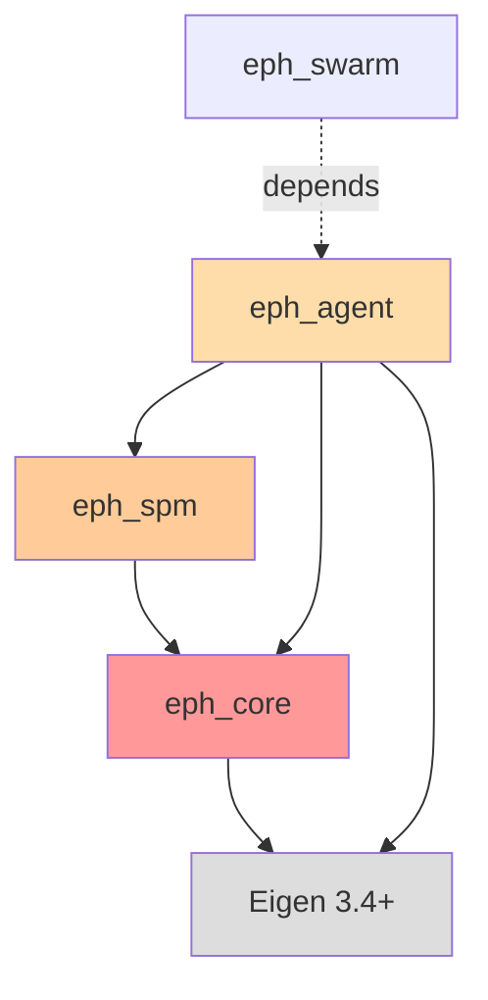

# eph_agent パッケージ仕様書

**最終更新**: 2026-02-02
**パッケージ層**: Layer 2（エージェント動力学）
**依存関係**: eph_core + eph_spm + Eigen 3.4+

## このドキュメントの目的

eph_agentパッケージの設計仕様と実装ガイドを提供します。Layer 2として、単一エージェントの認知・行為決定・Haze推定を実装します。

**対象読者**: Phase 2担当者、eph_swarm開発者

---

## 目次

1. [パッケージ概要](#1-パッケージ概要)
2. [ファイル構成](#2-ファイル構成)
3. [HazeEstimatorクラス](#3-hazeestimator-クラス)
4. [EPHAgentクラス](#4-ephagent-クラス)
5. [Haze推定式の実装](#5-haze推定式の実装)
6. [Stop-Gradient実装](#6-stop-gradient実装)
7. [テスト方針](#7-テスト方針)
8. [使用例](#8-使用例)

---

## 1. パッケージ概要

### 1.1 役割

eph_agentは **Layer 2（エージェント動力学層）** として以下を提供:

1. **Haze推定**: 予測誤差・不確実性から内在的にhazeを推定（§4.2）
2. **行為決定**: Expected Free Energy勾配降下による最適行為選択（§2.3-2.4）
3. **Hazeゲーティング**: κ依存のstop-gradient付きゲート（崩壊防止）
4. **エージェント状態管理**: 位置・速度・κ・fatigue

### 1.2 依存関係



**重要**: eph_agentはeph_core + eph_spmに依存（eph_swarmには依存しない）

### 1.3 理論的根拠

**参照**: `doc/EPH-2.1_main.md` §2.3-2.4, §4.2

- **Haze推定式（§4.2）**:
  $$\widetilde{h}[k] = \sigma\Big(a\,\text{EMA}(e[k]) + b\,\text{R1}[k] + c\,(1-\text{F4}[k]) + d\,\text{F5}[k]\Big)$$

- **Stop-Gradient（§2.4）**:
  $$\text{sg}[h[k]]$$ により、行為更新 $\mathbf{u}[k]$ の勾配計算でhazeを微分しない

- **行為更新（§2.3）**:
  $$\mathbf{u}[k] \leftarrow \mathbf{u}[k] - \eta\,(1 - \text{R1}[k]) \cdot \text{F4}[k] \cdot (1 - \kappa\,\text{sg}[h[k]]) \odot \nabla_{\mathbf{u}}\widehat{\Delta O}[k+1]$$

---

## 2. ファイル構成

### 2.1 ディレクトリ構造

```
packages/eph_agent/
├── CMakeLists.txt
├── include/
│   └── eph_agent/
│       ├── haze_estimator.hpp      # Haze推定クラス
│       ├── eph_agent.hpp           # EPHAgentクラス
│       └── action_selector.hpp     # 行為選択（Phase 3で拡張）
├── src/
│   └── (ヘッダーオンリーのため空)
└── tests/
    ├── CMakeLists.txt
    ├── test_haze_estimator.cpp     # Haze推定テスト（最重要）
    └── test_eph_agent.cpp          # EPHAgentテスト
```

### 2.2 CMakeLists.txt

```cmake
cmake_minimum_required(VERSION 3.20)
project(eph_agent VERSION 2.1.0 LANGUAGES CXX)

set(CMAKE_CXX_STANDARD 17)
set(CMAKE_CXX_STANDARD_REQUIRED ON)

find_package(Eigen3 REQUIRED NO_MODULE)

# ヘッダーオンリーライブラリ
add_library(eph_agent INTERFACE)
target_include_directories(eph_agent INTERFACE
    $<BUILD_INTERFACE:${CMAKE_CURRENT_SOURCE_DIR}/include>
    $<INSTALL_INTERFACE:include>
)

# eph_core + eph_spmへの依存
target_link_libraries(eph_agent INTERFACE
    eph_core
    eph_spm
    Eigen3::Eigen
)

# テスト
if(BUILD_TESTING)
    find_package(GTest REQUIRED)
    add_subdirectory(tests)
endif()
```

---

## 3. HazeEstimator クラス

### 3.1 クラス定義

```cpp
namespace eph::agent {

class HazeEstimator {
public:
    using Scalar = eph::Scalar;
    using Matrix12x12 = eph::Matrix12x12;

    // コンストラクタ
    explicit HazeEstimator(Scalar tau = 1.0);

    // Haze推定（§4.2の式）
    auto estimate(
        const spm::SaliencyPolarMap& spm,
        Scalar prediction_error
    ) -> Matrix12x12;

    // EMAフィルタリセット
    void reset();

private:
    Scalar tau_;                  // EMA時定数
    Matrix12x12 ema_error_;       // 予測誤差のEMA
    bool initialized_;

    // ガウシアンブラー（空間平滑化）
    auto gaussian_blur(const Matrix12x12& input, Scalar sigma) const -> Matrix12x12;
};

}  // namespace eph::agent
```

### 3.2 主要メソッド

| メソッド | 説明 | 戻り値 |
|---------|------|--------|
| `estimate(spm, prediction_error)` | §4.2の式でhazeを推定 | `Matrix12x12` [0, 1] |
| `reset()` | EMAフィルタをリセット | void |
| `gaussian_blur(input, sigma)` | 空間平滑化（σ=1.0） | `Matrix12x12` |

### 3.3 実装の重要ポイント

#### Haze推定式（§4.2）

```cpp
auto HazeEstimator::estimate(
    const spm::SaliencyPolarMap& spm,
    Scalar prediction_error
) -> Matrix12x12 {
    using namespace eph::constants;
    using namespace eph::math;

    // EMA更新
    if (!initialized_) {
        ema_error_ = Matrix12x12::Constant(prediction_error);
        initialized_ = true;
    } else {
        Scalar alpha = 1.0 / tau_;
        ema_error_ = alpha * Matrix12x12::Constant(prediction_error) +
                     (1.0 - alpha) * ema_error_;
    }

    // チャネル取得
    auto R1 = spm.get_channel(ChannelID::R1);  // 不確実性
    auto F4 = spm.get_channel(ChannelID::F4);  // 可視性
    auto F5 = spm.get_channel(ChannelID::F5);  // 観測安定性

    // 入力構成（§4.2の式）
    auto input = HAZE_COEFF_A * ema_error_ +
                 HAZE_COEFF_B * R1 +
                 HAZE_COEFF_C * (Matrix12x12::Ones() - F4) +
                 HAZE_COEFF_D * F5;

    // 数値安定性: 入力クリッピング
    input = input.cwiseMax(SIGMOID_CLIP_MIN).cwiseMin(SIGMOID_CLIP_MAX);

    // Sigmoid適用
    Matrix12x12 h_tilde;
    for (int a = 0; a < 12; ++a) {
        for (int b = 0; b < 12; ++b) {
            h_tilde(a, b) = sigmoid(input(a, b));
        }
    }

    // 空間平滑化
    return gaussian_blur(h_tilde, 1.0);
}
```

#### ガウシアンブラー

```cpp
auto HazeEstimator::gaussian_blur(const Matrix12x12& input, Scalar sigma) const -> Matrix12x12 {
    using namespace eph::math;

    // 簡易的な3×3ガウシアンカーネル（σ≈1）
    // [1 2 1]
    // [2 4 2] / 16
    // [1 2 1]
    Matrix12x12 output = Matrix12x12::Zero();

    for (int a = 0; a < 12; ++a) {
        for (int b = 0; b < 12; ++b) {
            Scalar sum = 0.0;
            Scalar weight_sum = 0.0;

            for (int da = -1; da <= 1; ++da) {
                for (int db = -1; db <= 1; ++db) {
                    int na = wrap_index(a + da, 12);  // θ方向: 周期境界
                    int nb = clamp_index(b + db, 12); // r方向: Neumann境界

                    Scalar weight = (da == 0 && db == 0) ? 4.0 :
                                   (da == 0 || db == 0) ? 2.0 : 1.0;

                    sum += weight * input(na, nb);
                    weight_sum += weight;
                }
            }
            output(a, b) = sum / weight_sum;
        }
    }
    return output;
}
```

---

## 4. EPHAgent クラス

### 4.1 クラス定義（Phase 2簡易版）

```cpp
namespace eph::agent {

class EPHAgent {
public:
    using Scalar = eph::Scalar;
    using Vec2 = eph::Vec2;
    using Matrix12x12 = eph::Matrix12x12;

    // コンストラクタ
    EPHAgent(const AgentState& initial_state, Scalar kappa);

    // 状態更新（Phase 3で行為決定を実装）
    void update(const spm::SaliencyPolarMap& spm, Scalar dt);

    // Haze推定
    auto estimate_haze(const spm::SaliencyPolarMap& spm, Scalar prediction_error) -> Matrix12x12;

    // 状態アクセス
    auto state() const -> const AgentState& { return state_; }
    auto kappa() const -> Scalar { return state_.kappa; }
    auto haze() const -> const Matrix12x12& { return haze_; }

private:
    AgentState state_;
    Matrix12x12 haze_;
    HazeEstimator haze_estimator_;
};

}  // namespace eph::agent
```

### 4.2 主要メソッド

| メソッド | 説明 | 戻り値 |
|---------|------|--------|
| `update(spm, dt)` | 状態更新（Phase 3で拡張） | void |
| `estimate_haze(spm, error)` | Haze推定 | `Matrix12x12` |
| `state()` | エージェント状態取得 | `const AgentState&` |
| `haze()` | 現在のHazeフィールド取得 | `const Matrix12x12&` |

---

## 5. Haze推定式の実装

### 5.1 理論式（§4.2）

$$
\widetilde{h}[k] = \sigma\Big(
a\,\text{EMA}(e[k]) + b\,\text{R1}[k] + c\,(1-\text{F4}[k]) + d\,\text{F5}[k]
\Big)
$$

### 5.2 パラメータ（`eph_core/constants.hpp`で定義済み）

```cpp
constexpr Scalar HAZE_COEFF_A = 0.4;  // 予測誤差の重み
constexpr Scalar HAZE_COEFF_B = 0.3;  // 不確実性の重み
constexpr Scalar HAZE_COEFF_C = 0.2;  // 不可視性の重み
constexpr Scalar HAZE_COEFF_D = 0.1;  // 観測不安定性の重み
```

### 5.3 EMAフィルタ

**指数移動平均（EMA）**:
$$\text{EMA}[k] = \alpha \cdot e[k] + (1 - \alpha) \cdot \text{EMA}[k-1]$$

**時定数**: $\alpha = 1 / \tau$（デフォルト $\tau = 1.0$）

---

## 6. Stop-Gradient実装

### 6.1 理論（§2.4）

Hazeは**非微分ゲート**として使用：

```cpp
// ❌ NG: Hazeで微分してしまう（崩壊の原因）
auto haze = agent.haze();
auto gate = (1.0 - R1.array()) * F4.array() * (1.0 - kappa * haze.array());

// ✅ OK: .eval()でstop-gradient
auto haze = agent.haze();
auto haze_sg = haze.eval();  // ← コピーして勾配追跡を切断
auto gate = (1.0 - R1.array()) * F4.array() * (1.0 - kappa * haze_sg.array());
```

### 6.2 Haze崩壊の症状

**症状**: 全エージェントのhaze → 0 or 1（二極化）

**原因**:
1. Stop-gradient忘れ（Hazeで微分）
2. Sigmoid飽和（入力クリッピング不足）
3. EMAの初期化ミス

**対策**:
- `.eval()`で明示的にコピー
- 入力クリッピング `[-10, 10]`
- EMA初期化時に適切な値を設定

---

## 7. テスト方針

### 7.1 Haze推定テスト（最重要）

**ファイル**: `packages/eph_agent/tests/test_haze_estimator.cpp`

#### 値域テスト

```cpp
TEST(HazeEstimator, EstimatedHaze_InValidRange) {
    HazeEstimator estimator(1.0);
    spm::SaliencyPolarMap spm;

    // ランダムSPMデータ
    auto R1 = Matrix12x12::Random() * 0.5 + Matrix12x12::Constant(0.5);  // [0, 1]
    auto F4 = Matrix12x12::Random() * 0.5 + Matrix12x12::Constant(0.5);
    auto F5 = Matrix12x12::Random() * 0.5 + Matrix12x12::Constant(0.5);
    spm.set_channel(ChannelID::R1, R1);
    spm.set_channel(ChannelID::F4, F4);
    spm.set_channel(ChannelID::F5, F5);

    auto haze = estimator.estimate(spm, 0.5);

    // Haze ∈ [0, 1]
    for (int a = 0; a < 12; ++a) {
        for (int b = 0; b < 12; ++b) {
            EXPECT_GE(haze(a, b), 0.0);
            EXPECT_LE(haze(a, b), 1.0);
        }
    }
}
```

#### EMAフィルタテスト

```cpp
TEST(HazeEstimator, EMA_ConvergesToInput) {
    HazeEstimator estimator(1.0);
    spm::SaliencyPolarMap spm;

    // 一定の予測誤差を与え続ける
    Scalar constant_error = 0.8;
    for (int i = 0; i < 10; ++i) {
        estimator.estimate(spm, constant_error);
    }

    // EMAは入力値に収束する（τ=1なので速い）
    auto haze = estimator.estimate(spm, constant_error);
    // 検証: ema_error_ ≈ constant_error（内部状態は直接確認できないのでhazeの範囲で確認）
}
```

#### 空間平滑化テスト

```cpp
TEST(HazeEstimator, GaussianBlur_SmoothsField) {
    HazeEstimator estimator(1.0);

    // デルタ関数（中心のみ1）
    Matrix12x12 delta = Matrix12x12::Zero();
    delta(6, 6) = 1.0;

    // ブラー後は周辺にも広がる
    // （gaussian_blurは外部公開されていないので、間接的にテスト）
}
```

### 7.2 EPHAgentテスト

```cpp
TEST(EPHAgent, Constructor_InitializesCorrectly) {
    AgentState initial_state;
    initial_state.position = Vec2(0.0, 0.0);
    initial_state.velocity = Vec2(0.0, 0.0);
    initial_state.kappa = 1.0;
    initial_state.fatigue = 0.0;

    EPHAgent agent(initial_state, 1.0);

    EXPECT_DOUBLE_EQ(agent.kappa(), 1.0);
    EXPECT_DOUBLE_EQ(agent.state().position.x(), 0.0);
}
```

---

## 8. 使用例

### 8.1 単一エージェントのHaze推定

```cpp
#include "eph_agent/eph_agent.hpp"
#include "eph_spm/saliency_polar_map.hpp"

using namespace eph;
using namespace eph::agent;

int main() {
    // エージェント初期化
    AgentState initial_state;
    initial_state.kappa = 1.0;  // Follower
    EPHAgent agent(initial_state, 1.0);

    // SPM作成
    spm::SaliencyPolarMap spm;
    // ... SPMにデータ設定 ...

    // Haze推定
    Scalar prediction_error = 0.5;  // 予測誤差（Phase 3で実装）
    auto haze = agent.estimate_haze(spm, prediction_error);

    // Hazeフィールドの確認
    std::cout << "Haze at (θ=0, r=0): " << haze(0, 0) << std::endl;

    // Stop-gradient使用例（Phase 3で実装）
    auto haze_sg = haze.eval();  // ← 重要
    auto gate = (1.0 - spm.get_channel(ChannelID::R1).array()) *
                spm.get_channel(ChannelID::F4).array() *
                (1.0 - agent.kappa() * haze_sg.array());

    return 0;
}
```

### 8.2 Haze推定のデバッグ

```cpp
// Haze崩壊チェック
auto haze = agent.haze();
Scalar mean_haze = haze.mean();
Scalar std_haze = std::sqrt((haze.array() - mean_haze).square().mean());

if (std_haze < 0.01) {
    std::cerr << "WARNING: Haze collapse detected!" << std::endl;
    std::cerr << "Mean haze: " << mean_haze << std::endl;
}

// 値域チェック
Scalar min_haze = haze.minCoeff();
Scalar max_haze = haze.maxCoeff();
if (min_haze < 0.0 || max_haze > 1.0) {
    std::cerr << "ERROR: Haze out of range [" << min_haze << ", " << max_haze << "]" << std::endl;
}
```

---

## 付録A: Haze推定パラメータの調整

| パラメータ | デフォルト | 調整範囲 | 効果 |
|-----------|----------|---------|------|
| `HAZE_COEFF_A` | 0.4 | [0.2, 0.6] | 予測誤差の影響 |
| `HAZE_COEFF_B` | 0.3 | [0.1, 0.5] | 不確実性の影響 |
| `HAZE_COEFF_C` | 0.2 | [0.1, 0.4] | 不可視性の影響 |
| `HAZE_COEFF_D` | 0.1 | [0.0, 0.3] | 観測不安定性の影響 |
| `tau` (EMA) | 1.0 | [0.5, 5.0] | 応答速度 |
| `sigma` (blur) | 1.0 | [0.5, 2.0] | 空間平滑度 |

**調整指針**:
- Hazeが過敏（頻繁に変動）→ tau を増やす、sigma を増やす
- Hazeが鈍感（変化しない）→ tau を減らす、HAZE_COEFF_A を増やす

---

## 付録B: CMakeによる他パッケージからの利用

```cmake
# packages/eph_swarm/CMakeLists.txt（Phase 3）
cmake_minimum_required(VERSION 3.20)
project(eph_swarm VERSION 2.1.0 LANGUAGES CXX)

find_package(Eigen3 REQUIRED NO_MODULE)

add_library(eph_swarm src/swarm.cpp)
target_include_directories(eph_swarm PUBLIC include)

# eph_agentへの依存
target_link_libraries(eph_swarm PUBLIC
    eph_agent          # ← これでEPHAgent、HazeEstimatorが使える
    Eigen3::Eigen
)
```

---

**関連ドキュメント**:
- `.claude/01_development_docs/package_specs/eph_core.md` - 基本型定義
- `.claude/01_development_docs/package_specs/eph_spm.md` - SPM仕様
- `doc/EPH-2.1_main.md` §2.3-2.4, §4.2 - 理論的根拠
- `.claude/07_troubleshooting/haze_collapse.md` - Haze崩壊対策（Phase 2で作成）

**最終更新**: 2026-02-02
**Phase 2完了基準**: HazeEstimator実装 + 値域テスト全通過 + EMA動作確認
