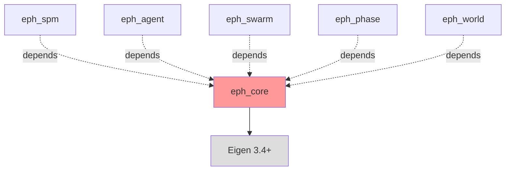

# eph_core パッケージ仕様書

**最終更新**: 2026-02-02
**パッケージ層**: Layer 0（基盤）
**依存関係**: Eigen 3.4+ のみ

## このドキュメントの目的

eph_coreパッケージの設計仕様と実装ガイドを提供します。Layer 0として、全パッケージが依存する基盤型定義・数学プリミティブ・共通設定を定義します。

**対象読者**: Phase 1担当者、全パッケージ開発者

---

## 目次

1. [パッケージ概要](#1-パッケージ概要)
2. [ファイル構成](#2-ファイル構成)
3. [主要な型定義](#3-主要な型定義)
4. [設定構造体](#4-設定構造体)
5. [数学ユーティリティ](#5-数学ユーティリティ)
6. [実装ノート](#6-実装ノート)
7. [テスト方針](#7-テスト方針)
8. [使用例](#8-使用例)

---

## 1. パッケージ概要

### 1.1 役割

eph_coreは **Layer 0（基盤層）** として以下を提供:

1. **型定義**: プロジェクト全体で使用する基本型（Scalar, Vec2, Tensor3等）
2. **共通構造体**: AgentState, SwarmConfig等
3. **数学定数**: π, 臨界値β_c等
4. **共通ユーティリティ**: clamp, wrap等の数学関数

### 1.2 依存関係



**重要**: eph_coreは他のephパッケージに依存しない（Eigenのみ依存）

---

## 2. ファイル構成

### 2.1 ディレクトリ構造

```
packages/eph_core/
├── CMakeLists.txt
├── include/
│   └── eph_core/
│       ├── types.hpp          # 基本型定義
│       ├── config.hpp         # 設定構造体
│       ├── constants.hpp      # 数学定数
│       └── math_utils.hpp     # 数学ユーティリティ
├── src/
│   ├── config.cpp             # 設定のデフォルト値
│   └── math_utils.cpp         # ユーティリティ実装
└── tests/
    ├── test_types.cpp         # 型定義のテスト
    ├── test_config.cpp        # 設定のテスト
    └── test_math_utils.cpp    # ユーティリティのテスト
```

### 2.2 CMakeLists.txt

```cmake
cmake_minimum_required(VERSION 3.20)
project(eph_core VERSION 2.1.0 LANGUAGES CXX)

# C++17必須
set(CMAKE_CXX_STANDARD 17)
set(CMAKE_CXX_STANDARD_REQUIRED ON)

# Eigenの検索
find_package(Eigen3 3.4 REQUIRED NO_MODULE)

# ライブラリ定義（ヘッダーオンリー）
add_library(eph_core INTERFACE)
target_include_directories(eph_core INTERFACE
    $<BUILD_INTERFACE:${CMAKE_CURRENT_SOURCE_DIR}/include>
    $<INSTALL_INTERFACE:include>
)
target_link_libraries(eph_core INTERFACE Eigen3::Eigen)

# テスト
if(BUILD_TESTING)
    enable_testing()
    add_subdirectory(tests)
endif()
```

---

## 3. 主要な型定義

### 3.1 types.hpp

```cpp
// eph_core/include/eph_core/types.hpp

#ifndef EPH_CORE_TYPES_HPP
#define EPH_CORE_TYPES_HPP

#include <Eigen/Core>
#include <Eigen/CXX11/Tensor>

namespace eph {

// ========== スカラー型 ==========

/// @brief 浮動小数点数型（プロジェクト全体で統一）
using Scalar = double;

// ========== ベクトル型 ==========

/// @brief 2次元ベクトル（位置、速度等）
using Vec2 = Eigen::Vector2d;

/// @brief 3次元ベクトル（将来の拡張用）
using Vec3 = Eigen::Vector3d;

// ========== テンソル型 ==========

/// @brief 3階テンソル（SPM用: C×θ×r）
/// @note メモリレイアウト: Column-major（Eigenデフォルト）
using Tensor3 = Eigen::Tensor<Scalar, 3>;

/// @brief 2階テンソル（行列）
using Matrix = Eigen::MatrixXd;

/// @brief 12×12行列（SPMチャネル用）
using Matrix12x12 = Eigen::Matrix<Scalar, 12, 12>;

// ========== エージェント状態 ==========

/**
 * @brief 単一エージェントの状態
 *
 * POD構造体（Plain Old Data）として定義。
 * Python連携時にシリアライズ可能。
 */
struct AgentState {
    Vec2 position;       ///< 位置 [m]
    Vec2 velocity;       ///< 速度 [m/s]
    Scalar kappa;        ///< ヘイズ感度（0.3-1.5）
    Scalar fatigue;      ///< 疲労度（0-1）

    /// @brief デフォルトコンストラクタ（ゼロ初期化）
    AgentState()
        : position(Vec2::Zero()),
          velocity(Vec2::Zero()),
          kappa(1.0),
          fatigue(0.0) {}
};

// ========== チャネルID ==========

/**
 * @brief SPMチャネルの識別子
 *
 * 参照: doc/appendix/EPH-2.1_appendix-B_spm.md
 */
enum class ChannelID : int {
    T0 = 0,  ///< Obs Occupancy (Teacher)
    R0 = 1,  ///< Δoccupancy (+1) - **学習対象**
    R1 = 2,  ///< Uncertainty of R0
    F0 = 3,  ///< Occupancy (Current)
    F1 = 4,  ///< Motion Pressure
    F2 = 5,  ///< Saliency
    F3 = 6,  ///< TTC Proxy
    F4 = 7,  ///< Visibility
    F5 = 8,  ///< Observation Stability
    M0 = 9   ///< Haze Field (stop-gradient)
};

}  // namespace eph

#endif  // EPH_CORE_TYPES_HPP
```

---

## 4. 設定構造体

### 4.1 config.hpp

```cpp
// eph_core/include/eph_core/config.hpp

#ifndef EPH_CORE_CONFIG_HPP
#define EPH_CORE_CONFIG_HPP

#include "eph_core/types.hpp"

namespace eph {

/**
 * @brief エージェント個別の設定
 */
struct AgentConfig {
    Scalar kappa = 1.0;            ///< ヘイズ感度（デフォルト: Follower）
    Scalar mass = 1.0;             ///< 質量 [kg]
    Scalar drag_coeff = 0.1;       ///< 抗力係数 [kg/m]
    Scalar eta = 0.1;              ///< 学習率（行為更新）
    Scalar tau_haze = 1.0;         ///< ヘイズ時定数 [s]
};

/**
 * @brief 群れ全体の設定
 */
struct SwarmConfig {
    size_t n_agents = 100;         ///< エージェント数
    Scalar beta = 0.098;           ///< MB破れ強度（臨界値）
    Scalar dt = 0.1;               ///< 時間刻み [s]
    int neighbor_count = 6;        ///< 平均近傍数（z）

    /// @brief 2:6:2役割分布の有効化
    bool use_role_distribution = true;
};

/**
 * @brief シミュレーション設定
 */
struct SimulationConfig {
    int max_steps = 10000;         ///< 最大ステップ数
    Scalar max_time = 1000.0;      ///< 最大時間 [s]
    int log_interval = 100;        ///< ログ出力間隔
    bool enable_visualization = false;  ///< リアルタイム可視化
};

}  // namespace eph

#endif  // EPH_CORE_CONFIG_HPP
```

---

## 5. 数学ユーティリティ

### 5.1 constants.hpp

```cpp
// eph_core/include/eph_core/constants.hpp

#ifndef EPH_CORE_CONSTANTS_HPP
#define EPH_CORE_CONSTANTS_HPP

#include "eph_core/types.hpp"

namespace eph {
namespace constants {

// ========== 数学定数 ==========

/// @brief 円周率
constexpr Scalar PI = 3.14159265358979323846;

/// @brief 自然対数の底
constexpr Scalar E = 2.71828182845904523536;

// ========== SPM定数 ==========

/// @brief SPMチャネル数
constexpr int N_CHANNELS = 10;

/// @brief SPM角度方向のグリッド数
constexpr int N_THETA = 12;

/// @brief SPM半径方向のグリッド数
constexpr int N_R = 12;

/// @brief 角度分解能 [rad]
constexpr Scalar DELTA_THETA = 2.0 * PI / N_THETA;

// ========== EPH理論定数 ==========

/// @brief 臨界点β_c（典型値、パラメータ依存）
/// @note 実際の値は Theorem 2 で計算: β_c = f(τ_haze, h̄, κ, η, L_f, z)
constexpr Scalar BETA_C_TYPICAL = 0.098;

/// @brief ヘイズ推定のパラメータ（§4.2推奨値）
constexpr Scalar HAZE_COEFF_A = 0.4;  ///< 予測誤差の重み
constexpr Scalar HAZE_COEFF_B = 0.3;  ///< 不確実性の重み
constexpr Scalar HAZE_COEFF_C = 0.2;  ///< 不可視性の重み
constexpr Scalar HAZE_COEFF_D = 0.1;  ///< 観測不安定性の重み

// ========== 数値安定性定数 ==========

/// @brief ゼロ除算防止のための微小値
constexpr Scalar EPS = 1e-6;

/// @brief sigmoid入力クリッピングの範囲
constexpr Scalar SIGMOID_CLIP_MIN = -10.0;
constexpr Scalar SIGMOID_CLIP_MAX = 10.0;

}  // namespace constants
}  // namespace eph

#endif  // EPH_CORE_CONSTANTS_HPP
```

### 5.2 math_utils.hpp

```cpp
// eph_core/include/eph_core/math_utils.hpp

#ifndef EPH_CORE_MATH_UTILS_HPP
#define EPH_CORE_MATH_UTILS_HPP

#include <algorithm>
#include <cmath>

#include "eph_core/types.hpp"

namespace eph {
namespace math {

/**
 * @brief 値を範囲内にクリップ
 * @param value クリップする値
 * @param min_val 最小値
 * @param max_val 最大値
 * @return クリップされた値
 */
inline Scalar clamp(Scalar value, Scalar min_val, Scalar max_val) {
    return std::max(min_val, std::min(value, max_val));
}

/**
 * @brief 角度を [-π, π) に正規化
 * @param angle 角度 [rad]
 * @return 正規化された角度
 */
inline Scalar wrap_angle(Scalar angle) {
    angle = std::fmod(angle + constants::PI, 2.0 * constants::PI);
    if (angle < 0.0) {
        angle += 2.0 * constants::PI;
    }
    return angle - constants::PI;
}

/**
 * @brief インデックスを周期境界でラップ（θ方向用）
 * @param index インデックス
 * @param size 配列サイズ
 * @return ラップされたインデックス [0, size)
 */
inline int wrap_index(int index, int size) {
    int result = index % size;
    return (result < 0) ? result + size : result;
}

/**
 * @brief インデックスをNeumann境界でクリップ（r方向用）
 * @param index インデックス
 * @param size 配列サイズ
 * @return クリップされたインデックス [0, size-1]
 */
inline int clamp_index(int index, int size) {
    return std::max(0, std::min(index, size - 1));
}

/**
 * @brief Sigmoid関数（数値安定版）
 * @param x 入力値
 * @return σ(x) = 1 / (1 + exp(-x))
 *
 * @note 入力を [-10, 10] にクリップして飽和を防ぐ
 */
inline Scalar sigmoid(Scalar x) {
    x = clamp(x, constants::SIGMOID_CLIP_MIN, constants::SIGMOID_CLIP_MAX);
    return 1.0 / (1.0 + std::exp(-x));
}

/**
 * @brief 線形補間
 * @param a 開始値
 * @param b 終了値
 * @param t 補間パラメータ [0, 1]
 * @return a + t*(b - a)
 */
inline Scalar lerp(Scalar a, Scalar b, Scalar t) {
    return a + t * (b - a);
}

}  // namespace math
}  // namespace eph

#endif  // EPH_CORE_MATH_UTILS_HPP
```

---

## 6. 実装ノート

### 6.1 ヘッダーオンリー vs コンパイル済みライブラリ

eph_coreは **ヘッダーオンリーライブラリ** として実装:

**理由**:
- 型定義・定数・インライン関数のみ → コンパイル不要
- 他パッケージでの最適化が容易（インライン展開）
- CMakeの依存解決が簡単

**例外**: 将来的に複雑なユーティリティ関数を追加する場合は `src/` に実装ファイルを作成可。

---

### 6.2 Eigen型のメモリレイアウト

**重要**: Eigenはデフォルトで **列優先（Column-major）**

```cpp
Eigen::Matrix<double, 12, 12> mat;
// メモリ配置: 列0, 列1, ..., 列11 の順

// Python NumPy（行優先）との変換時に注意
// 詳細: .claude/01_development_docs/python_guidelines/numpy_eigen_bridge.md
```

**Tensor3のメモリレイアウト**:
```cpp
Tensor3 spm(10, 12, 12);  // C×θ×r
// インデックス: spm(c, theta, r)
// メモリ順序: C方向が最も連続
```

---

### 6.3 POD構造体の設計

AgentStateは **POD (Plain Old Data)** として設計:

**制約**:
- ✅ 仮想関数なし
- ✅ トリビアルなコンストラクタ/デストラクタ
- ✅ 公開メンバーのみ
- ✅ 標準レイアウト

**利点**:
- Python連携時にコピー不要
- メモリアライメントが予測可能
- シリアライズが容易

```cpp
// ✅ Good: POD
struct AgentState {
    Vec2 position;
    Vec2 velocity;
    Scalar kappa;
    Scalar fatigue;
};

// ❌ Bad: PODでない
struct AgentState {
    virtual void update();  // 仮想関数 → PODでない
private:
    Vec2 position;          // プライベートメンバー → PODでない
};
```

---

## 7. テスト方針

### 7.1 テスト対象

| ファイル | テスト内容 |
|---------|----------|
| `test_types.cpp` | AgentStateのデフォルト値、ChannelID範囲 |
| `test_config.cpp` | 設定構造体のデフォルト値、境界値 |
| `test_math_utils.cpp` | clamp, wrap_angle, sigmoid等の正確性 |

### 7.2 test_types.cpp の例

```cpp
// eph_core/tests/test_types.cpp

#include <gtest/gtest.h>

#include "eph_core/types.hpp"

using namespace eph;

TEST(AgentState, DefaultConstructor_InitializesToZero) {
    AgentState state;

    EXPECT_DOUBLE_EQ(state.position.x(), 0.0);
    EXPECT_DOUBLE_EQ(state.position.y(), 0.0);
    EXPECT_DOUBLE_EQ(state.velocity.x(), 0.0);
    EXPECT_DOUBLE_EQ(state.velocity.y(), 0.0);
    EXPECT_DOUBLE_EQ(state.kappa, 1.0);      // デフォルト: Follower
    EXPECT_DOUBLE_EQ(state.fatigue, 0.0);
}

TEST(ChannelID, EnumValues_MatchExpected) {
    EXPECT_EQ(static_cast<int>(ChannelID::T0), 0);
    EXPECT_EQ(static_cast<int>(ChannelID::R0), 1);
    EXPECT_EQ(static_cast<int>(ChannelID::M0), 9);
}

TEST(Tensor3, Construction_CorrectShape) {
    Tensor3 spm(10, 12, 12);
    EXPECT_EQ(spm.dimension(0), 10);  // C
    EXPECT_EQ(spm.dimension(1), 12);  // θ
    EXPECT_EQ(spm.dimension(2), 12);  // r
}
```

### 7.3 test_math_utils.cpp の例

```cpp
// eph_core/tests/test_math_utils.cpp

#include <gtest/gtest.h>

#include "eph_core/math_utils.hpp"
#include "eph_core/constants.hpp"

using namespace eph;

TEST(MathUtils, Clamp_ValueInRange_ReturnsValue) {
    EXPECT_DOUBLE_EQ(math::clamp(0.5, 0.0, 1.0), 0.5);
}

TEST(MathUtils, Clamp_ValueBelowMin_ReturnsMin) {
    EXPECT_DOUBLE_EQ(math::clamp(-1.0, 0.0, 1.0), 0.0);
}

TEST(MathUtils, Clamp_ValueAboveMax_ReturnsMax) {
    EXPECT_DOUBLE_EQ(math::clamp(2.0, 0.0, 1.0), 1.0);
}

TEST(MathUtils, WrapAngle_LargePositive_WrapsCorrectly) {
    Scalar angle = 3.0 * constants::PI;
    Scalar wrapped = math::wrap_angle(angle);
    EXPECT_NEAR(wrapped, -constants::PI, 1e-10);
}

TEST(MathUtils, Sigmoid_Zero_ReturnsHalf) {
    EXPECT_DOUBLE_EQ(math::sigmoid(0.0), 0.5);
}

TEST(MathUtils, Sigmoid_LargePositive_ApproachesOne) {
    EXPECT_NEAR(math::sigmoid(100.0), 1.0, 1e-4);  // クリッピング効果
}

TEST(MathUtils, WrapIndex_Negative_WrapsAround) {
    EXPECT_EQ(math::wrap_index(-1, 12), 11);
    EXPECT_EQ(math::wrap_index(-13, 12), 11);
}

TEST(MathUtils, ClampIndex_Negative_ReturnsZero) {
    EXPECT_EQ(math::clamp_index(-1, 12), 0);
}

TEST(MathUtils, ClampIndex_TooLarge_ReturnsMaxIndex) {
    EXPECT_EQ(math::clamp_index(15, 12), 11);
}
```

---

## 8. 使用例

### 8.1 基本的な使い方

```cpp
#include "eph_core/types.hpp"
#include "eph_core/config.hpp"
#include "eph_core/constants.hpp"
#include "eph_core/math_utils.hpp"

using namespace eph;

int main() {
    // エージェント状態の作成
    AgentState state;
    state.position = Vec2(1.0, 2.0);
    state.velocity = Vec2(0.5, 0.3);
    state.kappa = 0.5;  // Leader

    // 設定の作成
    SwarmConfig config;
    config.n_agents = 50;
    config.beta = constants::BETA_C_TYPICAL;

    // 数学ユーティリティの使用
    Scalar angle = 3.5 * constants::PI;
    angle = math::wrap_angle(angle);  // [-π, π) に正規化

    // Tensor3の作成
    Tensor3 spm(constants::N_CHANNELS,
                constants::N_THETA,
                constants::N_R);
    spm.setZero();

    return 0;
}
```

### 8.2 他パッケージからの使用

```cpp
// eph_agent/src/agent.cpp

#include "eph_agent/agent.hpp"

#include "eph_core/types.hpp"       // AgentState, Vec2
#include "eph_core/constants.hpp"   // BETA_C_TYPICAL, EPS
#include "eph_core/math_utils.hpp"  // clamp, sigmoid

using namespace eph;

void EPHAgent::update_haze(Scalar dt) {
    // eph_core の型を使用
    Scalar input = compute_haze_input();

    // eph_core のユーティリティを使用
    input = math::clamp(input,
                        constants::SIGMOID_CLIP_MIN,
                        constants::SIGMOID_CLIP_MAX);

    Scalar h = math::sigmoid(input);

    // ...
}
```

---

## 9. Phase 1での実装タスク

### 9.1 実装順序

1. **types.hpp の作成** (30分)
   - AgentState, Vec2, Tensor3の定義
   - ChannelID enumの定義

2. **constants.hpp の作成** (15分)
   - 数学定数、SPM定数の定義

3. **math_utils.hpp の作成** (30分)
   - clamp, wrap_angle, sigmoid等の実装

4. **config.hpp の作成** (20分)
   - AgentConfig, SwarmConfig, SimulationConfigの定義

5. **テストの作成** (45分)
   - test_types.cpp
   - test_math_utils.cpp
   - test_config.cpp

6. **CMakeLists.txt の作成** (15分)
   - ヘッダーオンリーライブラリの設定
   - テストの設定

**合計**: 約2.5時間

### 9.2 完了基準

- ✅ すべてのヘッダーファイルがコンパイル可能
- ✅ `ctest` が100%パス
- ✅ 他パッケージ（eph_spm）から `#include "eph_core/types.hpp"` が可能

---

## 10. 関連ドキュメント

- **全体アーキテクチャ**: `CLAUDE.md §Package Hierarchy`
- **コーディング規約**: `.claude/01_development_docs/cpp_guidelines/coding_style.md`
- **Eigen使用法**: `.claude/01_development_docs/cpp_guidelines/eigen_patterns.md`（Phase 1で作成）
- **次のパッケージ**: `.claude/01_development_docs/package_specs/eph_spm.md`（Phase 1で作成）

---

*eph_coreはプロジェクトの基盤です。慎重に設計し、後方互換性を保ちながら拡張してください。*
