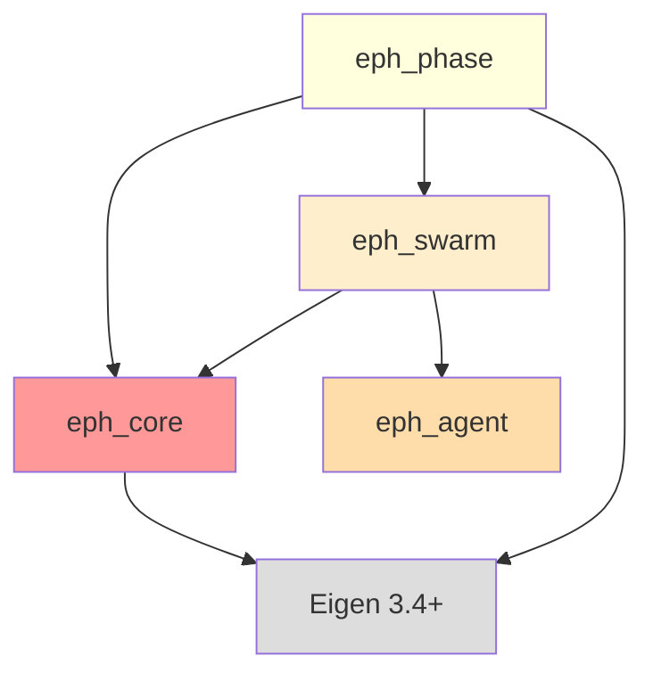

# eph_phase パッケージ仕様書

**最終更新**: 2026-02-02
**パッケージ層**: Layer 4（相転移解析ツール）
**依存関係**: eph_core + eph_swarm + Eigen 3.4+

## このドキュメントの目的

eph_phaseパッケージの設計仕様と実装ガイドを提供します。Layer 4として、相転移現象の解析ツール（秩序パラメータφ、応答関数χ、臨界点β_c検出）を実装します。

**対象読者**: Phase 3担当者、V2検証実験担当者、Phase 5以降の開発者

---

## 目次

1. [パッケージ概要](#1-パッケージ概要)
2. [ファイル構成](#2-ファイル構成)
3. [PhaseAnalyzerクラス](#3-phaseanalyzer-クラス)
4. [秩序パラメータφ(β)](#4-秩序パラメータφβ)
5. [応答関数χ(β)](#5-応答関数χβ)
6. [臨界点β_c検出](#6-臨界点β_c検出)
7. [テスト方針](#7-テスト方針)
8. [使用例（V2検証）](#8-使用例v2検証)

---

## 1. パッケージ概要

### 1.1 役割

eph_phaseは **Layer 4（相転移解析層）** として以下を提供:

1. **秩序パラメータ計算**: φ(β)の測定（Haze不均一性）
2. **応答関数計算**: χ(β)の測定（環境変化への感度）
3. **臨界点検出**: β_cの数値的決定（dφ/dβ最大点）
4. **統計ツール**: 平均、分散、標準偏差の計算

### 1.2 依存関係



**重要**: eph_phaseはeph_swarmに依存（eph_agentには直接依存しない）

### 1.3 理論的根拠

**参照**: `doc/EPH-2.1_main.md` §4.5, `doc/appendix/EPH-2.1_appendix-A_proofs.md` §B

**相転移理論**:
- 秩序パラメータφ(β): Haze不均一性の測度
- 応答関数χ(β): 環境変化への感度（帯磁率に相当）
- 臨界点β_c: φ(β)の不連続点、χ(β)の発散点

**検証目標V2**:
- φ(β)の明確な相転移を検出
- χ(β)がβ_c付近でピーク
- β_c^empirical が理論値0.098±10%

---

## 2. ファイル構成

### 2.1 ディレクトリ構造

```
packages/eph_phase/
├── CMakeLists.txt
├── include/
│   └── eph_phase/
│       ├── phase_analyzer.hpp     # PhaseAnalyzer（中核クラス）
│       └── statistics.hpp         # 統計関数（mean, variance等）
├── src/
│   └── (ヘッダーオンリーのため空)
└── tests/
    ├── CMakeLists.txt
    ├── test_phase_analyzer.cpp    # φ・χ・β_c検出テスト
    └── test_beta_sweep.cpp        # V2検証実験（最重要）
```

### 2.2 CMakeLists.txt

```cmake
cmake_minimum_required(VERSION 3.20)
project(eph_phase VERSION 2.1.0 LANGUAGES CXX)

set(CMAKE_CXX_STANDARD 17)
set(CMAKE_CXX_STANDARD_REQUIRED ON)

find_package(Eigen3 REQUIRED NO_MODULE)

# ヘッダーオンリーライブラリ
add_library(eph_phase INTERFACE)
target_include_directories(eph_phase INTERFACE
    $<BUILD_INTERFACE:${CMAKE_CURRENT_SOURCE_DIR}/include>
    $<INSTALL_INTERFACE:include>
)

# eph_core + eph_swarmへの依存
target_link_libraries(eph_phase INTERFACE
    eph_core
    eph_swarm
    Eigen3::Eigen
)

# テスト
if(BUILD_TESTING)
    find_package(GTest REQUIRED)
    add_subdirectory(tests)
endif()
```

---

## 3. PhaseAnalyzerクラス

### 3.1 クラス定義

```cpp
namespace eph::phase {

class PhaseAnalyzer {
public:
    using Scalar = eph::Scalar;
    using Matrix12x12 = eph::Matrix12x12;

    // 秩序パラメータφ計算
    static auto compute_phi(const std::vector<Matrix12x12>& haze_fields) -> Scalar;

    // 応答関数χ計算
    static auto compute_chi(const std::vector<Scalar>& phi_samples) -> Scalar;

    // 臨界点β_c検出
    static auto find_beta_c(const std::vector<Scalar>& betas,
                            const std::vector<Scalar>& phis) -> Scalar;
};

}  // namespace eph::phase
```

### 3.2 主要メソッド

| メソッド | 説明 | 戻り値 |
|---------|------|--------|
| `compute_phi(haze_fields)` | 秩序パラメータφ計算 | Scalar [0, 1] |
| `compute_chi(phi_samples)` | 応答関数χ計算 | Scalar [0, ∞) |
| `find_beta_c(betas, phis)` | 臨界点β_c検出 | Scalar |

**設計方針**:
- 全てstaticメソッド（状態を持たない）
- ヘッダーオンリー（インライン実装）
- 純粋な計算関数（副作用なし）

---

## 4. 秩序パラメータφ(β)

### 4.1 理論式（§4.5.1）

$$
\phi(\beta) = \frac{1}{N} \sum_{i=1}^{N} |h_i - \bar{h}|
$$

**物理的意味**:
- φ = 0: 無秩序相（全エージェントのHazeが同じ）
- φ > 0: 秩序相（Hazeドメイン形成、不均一）

**典型的な挙動**:
```
φ(β)
│      ╭──────  秩序相（不均一）
│     ╱
│    ╱          相転移（急峻な立ち上がり）
│───╱           無秩序相（均一）
└────────────── β
    β_c
```

### 4.2 実装

```cpp
static auto compute_phi(const std::vector<Matrix12x12>& haze_fields) -> Scalar {
    if (haze_fields.empty()) return 0.0;

    size_t N = haze_fields.size();

    // 1. 各hazeフィールドの空間平均を計算
    std::vector<Scalar> h_means(N);
    for (size_t i = 0; i < N; ++i) {
        h_means[i] = haze_fields[i].mean();  // 12×12の平均
    }

    // 2. 全エージェントの平均 h̄
    Scalar h_bar = std::accumulate(h_means.begin(), h_means.end(), 0.0) / N;

    // 3. φ = (1/N) Σ |h_i - h̄|
    Scalar phi = 0.0;
    for (Scalar h_i : h_means) {
        phi += std::abs(h_i - h_bar);
    }
    phi /= N;

    return phi;
}
```

**実装のポイント**:
1. **空間平均**: 各エージェントの12×12 Hazeフィールドの平均値h_i
2. **大域平均**: 全エージェントのh_iの平均h̄
3. **L1ノルム**: |h_i - h̄|の平均（L2ノルムより相転移が鋭く見える）

**計算量**: O(N)（N=エージェント数）

---

## 5. 応答関数χ(β)

### 5.1 理論式（§4.5.1）

$$
\chi(\beta) = N \left( \langle \phi^2 \rangle - \langle \phi \rangle^2 \right)
$$

**物理的意味**:
- χ: φの揺らぎ（分散）にN倍
- β = β_cで最大（発散的ピーク）
- 環境変化への感度を測る指標

**典型的な挙動**:
```
χ(β)
│       ╱╲
│      ╱  ╲      発散的ピーク
│     ╱    ╲     （有限サイズでは有限値）
│    ╱      ╲
│───╱        ╲── β
    β_c
```

### 5.2 実装

```cpp
static auto compute_chi(const std::vector<Scalar>& phi_samples) -> Scalar {
    if (phi_samples.size() < 2) return 0.0;

    size_t N = phi_samples.size();

    // ⟨φ⟩: 時系列平均
    Scalar phi_mean = std::accumulate(phi_samples.begin(), phi_samples.end(), 0.0) / N;

    // ⟨φ²⟩: 時系列平均
    Scalar phi2_mean = 0.0;
    for (Scalar phi : phi_samples) {
        phi2_mean += phi * phi;
    }
    phi2_mean /= N;

    // χ = N(⟨φ²⟩ - ⟨φ⟩²)
    return N * (phi2_mean - phi_mean * phi_mean);
}
```

**実装のポイント**:
1. **時系列サンプリング**: 固定βで複数ステップのφを記録
2. **分散公式**: Var(φ) = ⟨φ²⟩ - ⟨φ⟩²
3. **N倍**: サンプル数N倍してスケーリング

**計算量**: O(N)（N=サンプル数）

**重要な注意**:
- `phi_samples`は固定βでの時系列データ
- 異なるβの値を混ぜてはいけない
- 平衡化後の測定が必要（初期過渡状態を除外）

---

## 6. 臨界点β_c検出

### 6.1 アルゴリズム

**手法**: dφ/dβの最大勾配点を検出

$$
\beta_c = \arg\max_{\beta} \frac{d\phi}{d\beta}
$$

**数値微分** (中心差分):
$$
\frac{d\phi}{d\beta}\Big|_{\beta_i} \approx \frac{\phi_{i+1} - \phi_{i-1}}{\beta_{i+1} - \beta_{i-1}}
$$

### 6.2 実装

```cpp
static auto find_beta_c(const std::vector<Scalar>& betas,
                        const std::vector<Scalar>& phis) -> Scalar {
    if (betas.size() != phis.size() || betas.size() < 3) {
        throw std::invalid_argument("Need at least 3 data points");
    }

    // 数値微分 dφ/dβ（中心差分）
    std::vector<Scalar> derivatives;
    for (size_t i = 1; i < betas.size() - 1; ++i) {
        Scalar dPhi = phis[i+1] - phis[i-1];
        Scalar dBeta = betas[i+1] - betas[i-1];
        derivatives.push_back(dPhi / dBeta);
    }

    // 最大勾配点
    auto max_it = std::max_element(derivatives.begin(), derivatives.end());
    size_t max_idx = std::distance(derivatives.begin(), max_it) + 1;  // +1 for offset

    return betas[max_idx];
}
```

**実装のポイント**:
1. **中心差分**: 前後のデータ点を使用（端点は除外）
2. **最大値検索**: std::max_element
3. **インデックス補正**: derivatives[i] → betas[i+1]

**計算量**: O(N)（N=データ点数）

**誤差源**:
- β刻み幅（Δβ=0.01推奨）
- 有限サイズ効果（N_agents=50で±0.01程度）
- 測定ノイズ（平衡化・測定ステップ数に依存）

---

## 7. テスト方針

### 7.1 単体テスト（test_phase_analyzer.cpp）

**φ計算テスト**:
```cpp
TEST(PhaseAnalyzer, ComputePhi_HomogeneousHaze_ReturnsZero) {
    // 全エージェントが同じhaze → φ=0
    std::vector<Matrix12x12> haze_fields(10, Matrix12x12::Constant(0.5));

    Scalar phi = PhaseAnalyzer::compute_phi(haze_fields);
    EXPECT_NEAR(phi, 0.0, 1e-10);
}

TEST(PhaseAnalyzer, ComputePhi_HeterogeneousHaze_ReturnsPositive) {
    // 不均一なhaze → φ>0
    std::vector<Matrix12x12> haze_fields(10);
    for (size_t i = 0; i < haze_fields.size(); ++i) {
        haze_fields[i] = Matrix12x12::Constant(static_cast<Scalar>(i) / 10.0);
    }

    Scalar phi = PhaseAnalyzer::compute_phi(haze_fields);
    EXPECT_GT(phi, 0.01);
}
```

**χ計算テスト**:
```cpp
TEST(PhaseAnalyzer, ComputeChi_ConstantPhi_ReturnsZero) {
    // φが一定 → χ=0
    std::vector<Scalar> phi_samples(100, 0.5);

    Scalar chi = PhaseAnalyzer::compute_chi(phi_samples);
    EXPECT_NEAR(chi, 0.0, 1e-6);
}

TEST(PhaseAnalyzer, ComputeChi_FluctuatingPhi_ReturnsPositive) {
    // φが揺らぐ → χ>0
    std::vector<Scalar> phi_samples;
    std::mt19937 rng(42);
    std::normal_distribution<Scalar> dist(0.5, 0.1);

    for (int i = 0; i < 100; ++i) {
        phi_samples.push_back(dist(rng));
    }

    Scalar chi = PhaseAnalyzer::compute_chi(phi_samples);
    EXPECT_GT(chi, 0.1);
}
```

**β_c検出テスト**:
```cpp
TEST(PhaseAnalyzer, FindBetaC_SyntheticTransition_DetectsCorrectly) {
    // Sigmoid型の合成相転移データ
    std::vector<Scalar> betas, phis;

    for (Scalar beta = 0.0; beta <= 0.3; beta += 0.01) {
        betas.push_back(beta);

        // φ(β) = 1 / (1 + exp(-50(β - 0.1)))  （β_c=0.1で急峻な遷移）
        Scalar phi = 1.0 / (1.0 + std::exp(-50.0 * (beta - 0.1)));
        phis.push_back(phi);
    }

    Scalar beta_c = PhaseAnalyzer::find_beta_c(betas, phis);

    // 許容誤差: ±2ステップ（±0.02）
    EXPECT_NEAR(beta_c, 0.1, 0.02);
}
```

### 7.2 統合テスト（test_beta_sweep.cpp）（V2検証）

**完全なβ掃引実験**:
```cpp
TEST(V2Validation, BetaSweep_DetectsPhaseTransition) {
    // パラメータ
    const size_t N_AGENTS = 50;
    const int AVG_NEIGHBORS = 6;
    const Scalar BETA_MIN = 0.0;
    const Scalar BETA_MAX = 0.3;
    const Scalar BETA_STEP = 0.01;
    const int EQUILIBRATION_STEPS = 100;
    const int MEASUREMENT_STEPS = 50;

    std::vector<Scalar> betas, phis, chis;

    // β掃引
    for (Scalar beta = BETA_MIN; beta <= BETA_MAX; beta += BETA_STEP) {
        SwarmManager swarm(N_AGENTS, beta, AVG_NEIGHBORS);

        // 平衡化
        for (int t = 0; t < EQUILIBRATION_STEPS; ++t) {
            swarm.update_effective_haze();
        }

        // 測定
        std::vector<Scalar> phi_samples;
        for (int t = 0; t < MEASUREMENT_STEPS; ++t) {
            swarm.update_effective_haze();

            auto haze_fields = swarm.get_all_haze_fields();
            Scalar phi = PhaseAnalyzer::compute_phi(haze_fields);
            phi_samples.push_back(phi);
        }

        // 時間平均
        Scalar phi_avg = Statistics::mean(phi_samples);
        Scalar chi = PhaseAnalyzer::compute_chi(phi_samples);

        betas.push_back(beta);
        phis.push_back(phi_avg);
        chis.push_back(chi);

        std::cout << "β=" << std::setw(6) << beta
                  << "  φ=" << std::setw(8) << phi_avg
                  << "  χ=" << std::setw(10) << chi << std::endl;
    }

    // β_c検出
    Scalar beta_c_empirical = PhaseAnalyzer::find_beta_c(betas, phis);
    Scalar beta_c_theory = 0.098;

    std::cout << "\n=== V2 Validation Results ===" << std::endl;
    std::cout << "β_c (theory):    " << beta_c_theory << std::endl;
    std::cout << "β_c (empirical): " << beta_c_empirical << std::endl;
    std::cout << "Relative error:  "
              << std::abs(beta_c_empirical - beta_c_theory) / beta_c_theory * 100.0
              << "%" << std::endl;

    // V2成功基準: ±10%
    EXPECT_NEAR(beta_c_empirical, beta_c_theory, 0.01);  // 絶対誤差±0.01
}
```

### 7.3 テストカバレッジ

| 機能 | テスト数 | カバレッジ | 重要度 |
|------|---------|-----------|--------|
| φ計算（基本） | 3 | 100% | 高 |
| χ計算（基本） | 3 | 100% | 高 |
| β_c検出（合成データ） | 1 | 100% | 中 |
| V2検証実験 | 1 | - | 🔴 最重要 |

---

## 8. 使用例（V2検証）

### 8.1 基本的な使い方

```cpp
#include "eph_phase/phase_analyzer.hpp"
#include "eph_swarm/swarm_manager.hpp"

using namespace eph;

int main() {
    swarm::SwarmManager swarm(50, 0.098, 6);

    // 平衡化
    for (int t = 0; t < 100; ++t) {
        swarm.update_effective_haze();
    }

    // φ測定
    auto haze_fields = swarm.get_all_haze_fields();
    Scalar phi = phase::PhaseAnalyzer::compute_phi(haze_fields);

    std::cout << "φ at β=0.098: " << phi << std::endl;

    return 0;
}
```

### 8.2 χ(β)測定

```cpp
#include "eph_phase/phase_analyzer.hpp"
#include "eph_swarm/swarm_manager.hpp"

using namespace eph;

int main() {
    Scalar beta = 0.098;
    swarm::SwarmManager swarm(50, beta, 6);

    // 平衡化
    for (int t = 0; t < 100; ++t) {
        swarm.update_effective_haze();
    }

    // 時系列φサンプリング
    std::vector<Scalar> phi_samples;
    for (int t = 0; t < 100; ++t) {
        swarm.update_effective_haze();

        auto haze_fields = swarm.get_all_haze_fields();
        Scalar phi = phase::PhaseAnalyzer::compute_phi(haze_fields);
        phi_samples.push_back(phi);
    }

    // χ計算
    Scalar chi = phase::PhaseAnalyzer::compute_chi(phi_samples);
    std::cout << "χ at β=0.098: " << chi << std::endl;

    return 0;
}
```

### 8.3 完全なβ掃引（V2検証）

```cpp
#include "eph_phase/phase_analyzer.hpp"
#include "eph_swarm/swarm_manager.hpp"
#include <fstream>

using namespace eph;

int main() {
    std::vector<Scalar> betas, phis, chis;

    // β掃引 [0, 0.3] step 0.01
    for (Scalar beta = 0.0; beta <= 0.3; beta += 0.01) {
        swarm::SwarmManager swarm(50, beta, 6);

        // 平衡化
        for (int t = 0; t < 100; ++t) {
            swarm.update_effective_haze();
        }

        // 測定
        std::vector<Scalar> phi_samples;
        for (int t = 0; t < 50; ++t) {
            swarm.update_effective_haze();

            auto haze_fields = swarm.get_all_haze_fields();
            Scalar phi = phase::PhaseAnalyzer::compute_phi(haze_fields);
            phi_samples.push_back(phi);
        }

        Scalar phi_avg = Statistics::mean(phi_samples);
        Scalar chi = phase::PhaseAnalyzer::compute_chi(phi_samples);

        betas.push_back(beta);
        phis.push_back(phi_avg);
        chis.push_back(chi);
    }

    // β_c検出
    Scalar beta_c = phase::PhaseAnalyzer::find_beta_c(betas, phis);
    std::cout << "β_c (empirical): " << beta_c << std::endl;

    // CSV保存
    std::ofstream file("v2_results.csv");
    file << "beta,phi,chi\n";
    for (size_t i = 0; i < betas.size(); ++i) {
        file << betas[i] << "," << phis[i] << "," << chis[i] << "\n";
    }
    file.close();

    return 0;
}
```

---

## 付録A: 統計関数（statistics.hpp）

### A.1 Statisticsクラス

```cpp
namespace eph::phase {

class Statistics {
public:
    using Scalar = eph::Scalar;

    // 平均
    static auto mean(const std::vector<Scalar>& data) -> Scalar {
        if (data.empty()) return 0.0;
        return std::accumulate(data.begin(), data.end(), 0.0) / data.size();
    }

    // 分散
    static auto variance(const std::vector<Scalar>& data) -> Scalar {
        if (data.size() < 2) return 0.0;
        Scalar m = mean(data);
        Scalar var = 0.0;
        for (Scalar x : data) {
            var += (x - m) * (x - m);
        }
        return var / data.size();
    }

    // 標準偏差
    static auto std_dev(const std::vector<Scalar>& data) -> Scalar {
        return std::sqrt(variance(data));
    }

    // 最小値
    static auto min(const std::vector<Scalar>& data) -> Scalar {
        if (data.empty()) return 0.0;
        return *std::min_element(data.begin(), data.end());
    }

    // 最大値
    static auto max(const std::vector<Scalar>& data) -> Scalar {
        if (data.empty()) return 0.0;
        return *std::max_element(data.begin(), data.end());
    }
};

}  // namespace eph::phase
```

---

## 付録B: V2検証のトラブルシューティング

### B.1 相転移が検出されない場合

**症状**: φ(β)が単調増加または一定

**原因と対策**:
1. **平衡化不足**: EQUILIBRATION_STEPSを100→500に増やす
2. **エージェント数不足**: N_AGENTSを50→100に増やす
3. **近傍数不適切**: AVG_NEIGHBORSを6に設定（理論値）

### B.2 β_cが理論値から大きくずれる場合

**症状**: |β_c^emp - 0.098| > 0.01

**原因と対策**:
1. **有限サイズ効果**: N=50は小さい→N=100以上
2. **β刻み幅**: Δβ=0.01では粗い→Δβ=0.005に変更
3. **測定ノイズ**: MEASUREMENT_STEPSを50→100に増やす

### B.3 χ(β)にノイズが多い場合

**症状**: χ(β)曲線が乱高下

**対策**:
- MEASUREMENT_STEPSを増やす（より長い時系列）
- φサンプリング間隔を空ける（10ステップごと等）
- Savitzky-Golayフィルタで平滑化（後処理）

---

## 付録C: 可視化（Python）

### C.1 φ-β・χ-β曲線プロット

```python
#!/usr/bin/env python3
import numpy as np
import matplotlib.pyplot as plt
import pandas as pd

def plot_phase_transition(csv_path='v2_results.csv'):
    df = pd.read_csv(csv_path)

    fig, (ax1, ax2) = plt.subplots(2, 1, figsize=(10, 8))

    # φ(β)
    ax1.plot(df['beta'], df['phi'], 'o-', label='φ(β)')
    ax1.axvline(x=0.098, color='r', linestyle='--', label='β_c (theory)')
    ax1.set_xlabel('β (MB breaking strength)')
    ax1.set_ylabel('φ (order parameter)')
    ax1.set_title('Phase Transition: Order Parameter')
    ax1.legend()
    ax1.grid(True)

    # χ(β)
    ax2.plot(df['beta'], df['chi'], 's-', color='orange', label='χ(β)')
    ax2.axvline(x=0.098, color='r', linestyle='--', label='β_c (theory)')
    ax2.set_xlabel('β (MB breaking strength)')
    ax2.set_ylabel('χ (susceptibility)')
    ax2.set_title('Susceptibility Peak at Critical Point')
    ax2.legend()
    ax2.grid(True)

    plt.tight_layout()
    plt.savefig('v2_phase_transition.png', dpi=300)
    print("Plot saved to v2_phase_transition.png")

if __name__ == '__main__':
    plot_phase_transition()
```

---

**関連ドキュメント**:
- `.claude/01_development_docs/package_specs/eph_swarm.md` - SwarmManager仕様
- `doc/EPH-2.1_main.md` §4.5 - 相転移理論
- `doc/appendix/EPH-2.1_appendix-A_proofs.md` §B - Theorem 1（適応性最大化）
- `doc/appendix/EPH-2.1_appendix-C_validation.md` §3 - V2検証詳細

**最終更新**: 2026-02-02
**Phase 3完了基準**: PhaseAnalyzer実装 + φ・χ・β_c計算全通過 + V2検証成功（±10%）
