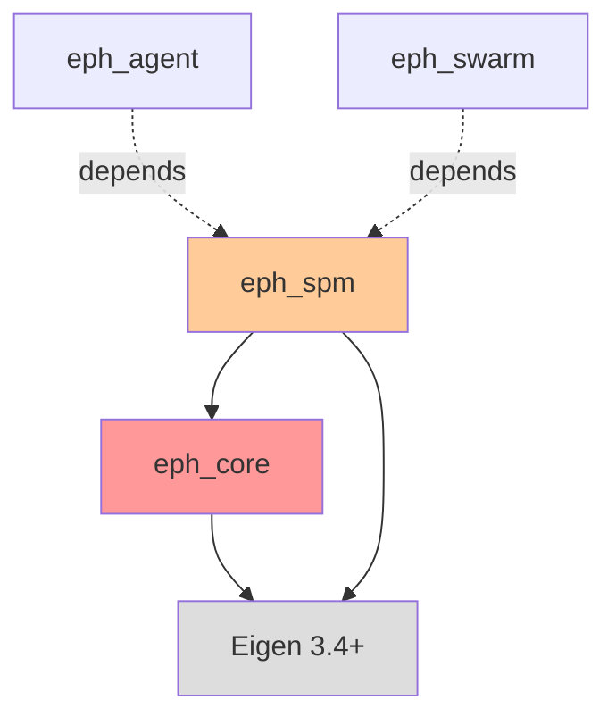

# eph_spm パッケージ仕様書

**最終更新**: 2026-02-02
**パッケージ層**: Layer 1（SPM管理）
**依存関係**: eph_core + Eigen 3.4+

## このドキュメントの目的

eph_spmパッケージの設計仕様と実装ガイドを提供します。Layer 1として、Saliency Polar Map（SPM）の10チャネル管理、境界条件を満たす勾配計算、Haze推定を実装します。

**対象読者**: Phase 1担当者、eph_agent/eph_swarm開発者

---

## 目次

1. [パッケージ概要](#1-パッケージ概要)
2. [ファイル構成](#2-ファイル構成)
3. [SaliencyPolarMapクラスAPI](#3-saliencypolarmap-クラスapi)
4. [10チャネル仕様](#4-10チャネル仕様)
5. [境界条件実装](#5-境界条件実装)
6. [Haze推定ロジック](#6-haze推定ロジック)
7. [テスト方針](#7-テスト方針)
8. [使用例](#8-使用例)

---

## 1. パッケージ概要

### 1.1 役割

eph_spmは **Layer 1（SPM管理層）** として以下を提供:

1. **SPMデータ構造**: 10チャネル × 12θ × 12r の極座標マップ管理
2. **境界条件付き勾配計算**: θ方向=周期境界、r方向=Neumann境界
3. **チャネルアクセス**: 個別チャネルの取得・設定API
4. **Haze推定基盤**: 予測誤差・不確実性から内在的にhazeを推定（Phase 2で拡張）

### 1.2 依存関係



**重要**: eph_spmはeph_coreとEigenのみに依存（eph_agent等には依存しない）

### 1.3 理論的根拠

**参照**: `doc/appendix/EPH-2.1_appendix-B_spm.md`

- **PR最小主義**: 予測対象はR0（Δ占有）のみ
- **PF/PR分離**: F0-F5は観測から直接構成
- **Haze推定**: M0はstop-gradient付きで予測誤差・不確実性から推定
- **FEP準拠**: 変分Free Energy $F_{\text{EPH}}$ との整合性

---

## 2. ファイル構成

### 2.1 ディレクトリ構造

```
packages/eph_spm/
├── CMakeLists.txt
├── include/
│   └── eph_spm/
│       ├── saliency_polar_map.hpp     # SPM中核クラス
│       ├── channels.hpp                # チャネルID定義（再エクスポート）
│       └── boundary_conditions.hpp     # 境界条件ヘルパー（将来拡張用）
├── src/
│   └── (ヘッダーオンリーのため空)
└── tests/
    ├── CMakeLists.txt
    ├── test_saliency_polar_map.cpp     # SPMクラステスト
    ├── test_boundary_conditions.cpp    # 境界条件検証（最重要）
    └── test_gradient.cpp               # 勾配計算精度検証
```

### 2.2 CMakeLists.txt

```cmake
cmake_minimum_required(VERSION 3.20)
project(eph_spm VERSION 2.1.0 LANGUAGES CXX)

set(CMAKE_CXX_STANDARD 17)
set(CMAKE_CXX_STANDARD_REQUIRED ON)

find_package(Eigen3 3.4 REQUIRED NO_MODULE)

# ヘッダーオンリーライブラリ
add_library(eph_spm INTERFACE)
target_include_directories(eph_spm INTERFACE
    $<BUILD_INTERFACE:${CMAKE_CURRENT_SOURCE_DIR}/include>
    $<INSTALL_INTERFACE:include>
)

# eph_coreへの依存
target_link_libraries(eph_spm INTERFACE
    eph_core           # ← 重要: Layer 0への依存
    Eigen3::Eigen
)

# テスト
if(BUILD_TESTING)
    find_package(GTest REQUIRED)
    add_subdirectory(tests)
endif()
```

---

## 3. SaliencyPolarMap クラスAPI

### 3.1 クラス定義

```cpp
namespace eph::spm {

class SaliencyPolarMap {
public:
    using Scalar = eph::Scalar;
    using Tensor3 = eph::Tensor3;
    using Matrix12x12 = eph::Matrix12x12;

    // コンストラクタ
    SaliencyPolarMap();

    // チャネルアクセス
    auto get_channel(ChannelID id) const -> Matrix12x12;
    void set_channel(ChannelID id, const Matrix12x12& data);

    // 境界条件を満たす勾配計算
    auto gradient_theta(ChannelID id) const -> Matrix12x12;  // θ方向: 周期境界
    auto gradient_r(ChannelID id) const -> Matrix12x12;      // r方向: Neumann境界
    auto gradient_magnitude(ChannelID id) const -> Matrix12x12;

    // ユーティリティ
    void zero_all();
    auto channel_count() const -> int { return 10; }
    auto theta_count() const -> int { return 12; }
    auto r_count() const -> int { return 12; }

private:
    Tensor3 data_;  // (10, 12, 12) = (C, θ, r)

    // 内部ヘルパー
    auto channel_to_matrix(int channel_idx) const -> Matrix12x12;
    void matrix_to_channel(int channel_idx, const Matrix12x12& mat);
};

}  // namespace eph::spm
```

### 3.2 主要メソッド

| メソッド | 説明 | 戻り値 |
|---------|------|--------|
| `get_channel(ChannelID)` | 指定チャネルの12×12行列を取得 | `Matrix12x12` |
| `set_channel(ChannelID, Matrix12x12)` | チャネルに値を設定 | void |
| `gradient_theta(ChannelID)` | θ方向勾配（周期境界） | `Matrix12x12` |
| `gradient_r(ChannelID)` | r方向勾配（Neumann境界） | `Matrix12x12` |
| `gradient_magnitude(ChannelID)` | 勾配の大きさ $\|\nabla\|$ | `Matrix12x12` |
| `zero_all()` | 全チャネルをゼロクリア | void |

---

## 4. 10チャネル仕様

### 4.1 チャネルID定義

**参照**: `doc/appendix/EPH-2.1_appendix-B_spm.md` §3-6

```cpp
// eph_core/types.hpp で定義済み
enum class ChannelID : int {
    T0 = 0,  // Obs Occupancy (Teacher) - 教師信号
    R0 = 1,  // Δoccupancy (+1) - 予測対象（唯一の学習チャネル）
    R1 = 2,  // Uncertainty - 予測不確実性
    F0 = 3,  // Occupancy (Current) - 現在占有
    F1 = 4,  // Motion Pressure - 運動圧
    F2 = 5,  // Saliency - 顕著性
    F3 = 6,  // TTC Proxy - 衝突時間代理
    F4 = 7,  // Visibility - 可視性
    F5 = 8,  // Observation Stability - 観測安定性
    M0 = 9   // Haze Field - ヘイズフィールド
};
```

### 4.2 チャネル分類

| カテゴリ | チャネル | 値域 | 生成方法 |
|---------|---------|------|---------|
| **T** (Teacher) | T0 | [0, 1] | 真値占有（学習時のみ） |
| **PR** (Prediction-Required) | R0 | [-1, 1] | **学習器出力（唯一の予測対象）** |
| | R1 | [0, 1] | 予測不確実性（分散等） |
| **PF** (Prediction-Free) | F0 | [0, 1] | 観測から直接計算 |
| | F1 | [0, ∞) | Optical Flow等から計算 |
| | F2 | [0, 1] | 顕著性検出器出力 |
| | F3 | [0, 1] | TTC逆数正規化 |
| | F4 | [0, 1] | 遮蔽検出器出力 |
| | F5 | [0, 1] | 時間的安定性指標 |
| **Meta** | M0 | [0, 1] | **Haze推定（stop-gradient）** |

### 4.3 重要な実装ノート

#### R0チャネル（唯一の学習対象）

```cpp
// ❌ NG: 複数チャネルを学習対象にしない
auto loss_r0 = mse(predicted_R0, target_T0);
auto loss_r1 = mse(predicted_R1, target_something);  // ← 不要

// ✅ OK: R0のみ学習
auto loss = mse(predicted_R0, target_T0);
```

#### M0チャネル（Haze推定 with stop-gradient）

```cpp
// ❌ NG: Hazeで微分してしまう（崩壊の原因）
auto haze = spm.get_channel(ChannelID::M0);
auto gate = (1 - R1) * F4 * (1 - kappa * haze);

// ✅ OK: .eval()でstop-gradient
auto haze = spm.get_channel(ChannelID::M0);
auto haze_sg = haze.eval();  // ← コピーして勾配追跡を切断
auto gate = (1 - R1) * F4 * (1 - kappa * haze_sg);
```

**理由**: Hazeで微分すると「Haze崩壊」（全エージェントのhaze → 0 or 1）が発生

---

## 5. 境界条件実装

### 5.1 幾何と境界条件

**参照**: `doc/appendix/EPH-2.1_appendix-B_spm.md` §2.1

| 方向 | インデックス | 境界条件 | 実装 |
|------|------------|---------|------|
| **θ（角度）** | a = 0..11 | 周期的 | `wrap_index(a+1, 12)` |
| **r（距離）** | b = 0..11 | Neumann（法線勾配0） | `clamp_index(b, 12)` + 端でゼロ勾配 |

### 5.2 θ方向勾配（周期境界）

```cpp
auto SaliencyPolarMap::gradient_theta(ChannelID id) const -> Matrix12x12 {
    using namespace eph::constants;
    using namespace eph::math;

    auto channel = get_channel(id);
    Matrix12x12 grad;

    for (int a = 0; a < N_THETA; ++a) {
        for (int b = 0; b < N_R; ++b) {
            // θ方向: 周期境界（a=0 と a=11 が隣接）
            int a_plus = wrap_index(a + 1, N_THETA);   // a=11 → 0
            int a_minus = wrap_index(a - 1, N_THETA);  // a=0 → 11

            // 中心差分
            grad(a, b) = (channel(a_plus, b) - channel(a_minus, b)) / (2.0 * DELTA_THETA);
        }
    }
    return grad;
}
```

**検証**: sin波を設定し、θ=0 と θ=11 で勾配の連続性を確認（テストで実施）

### 5.3 r方向勾配（Neumann境界）

```cpp
auto SaliencyPolarMap::gradient_r(ChannelID id) const -> Matrix12x12 {
    using namespace eph::constants;
    using namespace eph::math;

    auto channel = get_channel(id);
    Matrix12x12 grad;

    for (int a = 0; a < N_THETA; ++a) {
        for (int b = 0; b < N_R; ++b) {
            if (b == 0 || b == N_R - 1) {
                // r方向: Neumann境界（端でゼロ勾配）
                grad(a, b) = 0.0;
            } else {
                // 内部: 中心差分
                int b_plus = clamp_index(b + 1, N_R);
                int b_minus = clamp_index(b - 1, N_R);
                grad(a, b) = (channel(a, b_plus) - channel(a, b_minus)) / 2.0;
            }
        }
    }
    return grad;
}
```

**検証**: r方向線形増加データで、b=0, b=11 で勾配=0 を確認（テストで実施）

### 5.4 勾配の大きさ

```cpp
auto SaliencyPolarMap::gradient_magnitude(ChannelID id) const -> Matrix12x12 {
    auto grad_theta = gradient_theta(id);
    auto grad_r = gradient_r(id);

    Matrix12x12 mag;
    for (int a = 0; a < 12; ++a) {
        for (int b = 0; b < 12; ++b) {
            mag(a, b) = std::sqrt(grad_theta(a, b) * grad_theta(a, b) +
                                   grad_r(a, b) * grad_r(a, b));
        }
    }
    return mag;
}
```

---

## 6. Haze推定ロジック

### 6.1 理論式（§4.2）

**参照**: `doc/EPH-2.1_main.md` §4.2

$$
\widetilde{h}[k] = \sigma\Big(
a\,\text{EMA}(e[k]) + b\,\text{R1}[k] + c\,(1-\text{F4}[k]) + d\,\text{F5}[k]
\Big)
$$

**推奨パラメータ**（`eph_core/constants.hpp`で定義）:
- a = 0.4（予測誤差の重み）
- b = 0.3（不確実性の重み）
- c = 0.2（不可視性の重み）
- d = 0.1（観測不安定性の重み）

### 6.2 実装ノート（Phase 2で実装）

```cpp
// Phase 2（eph_agent）で実装予定
class HazeEstimator {
public:
    auto compute(const SPM& spm, const Scalar prediction_error) -> Matrix12x12 {
        using namespace eph::constants;

        // EMA更新（τ=1.0）
        auto e_ema = ema_.update(prediction_error);

        // 入力構成
        auto R1 = spm.get_channel(ChannelID::R1);
        auto F4 = spm.get_channel(ChannelID::F4);
        auto F5 = spm.get_channel(ChannelID::F5);

        auto input = HAZE_COEFF_A * e_ema +
                     HAZE_COEFF_B * R1 +
                     HAZE_COEFF_C * (1.0 - F4.array()).matrix() +
                     HAZE_COEFF_D * F5;

        // 数値安定性: 入力クリッピング
        input = input.cwiseMax(SIGMOID_CLIP_MIN).cwiseMin(SIGMOID_CLIP_MAX);

        // Sigmoid適用
        auto h_tilde = (1.0 + (-input.array()).exp()).inverse().matrix();

        // 空間平滑化（Gaussian blur, σ=1.0）
        return gaussian_blur(h_tilde, 1.0);
    }

private:
    EMAFilter ema_;
};
```

**Phase 1スコープ**: SPMクラスのみ実装、Haze推定はPhase 2

---

## 7. テスト方針

### 7.1 境界条件テスト（最重要）

**ファイル**: `packages/eph_spm/tests/test_boundary_conditions.cpp`

#### θ方向: 周期境界検証

```cpp
TEST(BoundaryConditions, GradientTheta_PeriodicWrap_Continuous) {
    SaliencyPolarMap spm;

    // sin波（周期12）を設定
    Matrix12x12 test_channel;
    for (int a = 0; a < 12; ++a) {
        for (int b = 0; b < 12; ++b) {
            test_channel(a, b) = std::sin(2.0 * M_PI * a / 12.0);
        }
    }
    spm.set_channel(ChannelID::M0, test_channel);

    auto grad = spm.gradient_theta(ChannelID::M0);

    // θ=0 と θ=11 で勾配の連続性確認
    for (int b = 0; b < 12; ++b) {
        EXPECT_NEAR(grad(0, b), grad(11, b), 1e-6)
            << "Periodic boundary violated at r=" << b;
    }

    // 理論値との比較（cos波）
    for (int a = 0; a < 12; ++a) {
        for (int b = 0; b < 12; ++b) {
            double expected = std::cos(2.0 * M_PI * a / 12.0) * (2.0 * M_PI / 12.0);
            EXPECT_NEAR(grad(a, b), expected, 1e-5);
        }
    }
}
```

#### r方向: Neumann境界検証

```cpp
TEST(BoundaryConditions, GradientR_NeumannZero_AtEdges) {
    SaliencyPolarMap spm;

    // r方向に線形増加
    Matrix12x12 test_channel;
    for (int a = 0; a < 12; ++a) {
        for (int b = 0; b < 12; ++b) {
            test_channel(a, b) = static_cast<double>(b) / 11.0;
        }
    }
    spm.set_channel(ChannelID::M0, test_channel);

    auto grad = spm.gradient_r(ChannelID::M0);

    // 境界（b=0, b=11）でゼロ勾配
    for (int a = 0; a < 12; ++a) {
        EXPECT_DOUBLE_EQ(grad(a, 0), 0.0)
            << "Neumann boundary violated at inner edge";
        EXPECT_DOUBLE_EQ(grad(a, 11), 0.0)
            << "Neumann boundary violated at outer edge";
    }

    // 内部（b=1..10）で一定勾配
    for (int a = 0; a < 12; ++a) {
        for (int b = 1; b <= 10; ++b) {
            double expected = 1.0 / 11.0 / 2.0;
            EXPECT_NEAR(grad(a, b), expected, 1e-6);
        }
    }
}
```

### 7.2 チャネル値域テスト

```cpp
TEST(SaliencyPolarMap, ChannelRange_ValidAfterSet) {
    SaliencyPolarMap spm;
    Matrix12x12 test_data = Matrix12x12::Random();  // [-1, 1]

    spm.set_channel(ChannelID::F0, test_data);
    auto retrieved = spm.get_channel(ChannelID::F0);

    EXPECT_TRUE(retrieved.isApprox(test_data, 1e-10));
}
```

### 7.3 勾配計算精度テスト

```cpp
TEST(SaliencyPolarMap, GradientMagnitude_MatchesTheory) {
    SaliencyPolarMap spm;

    // 既知の勾配を持つフィールドを設定
    // 理論値と数値計算の一致を検証
}
```

---

## 8. 使用例

### 8.1 基本的な使用法

```cpp
#include "eph_spm/saliency_polar_map.hpp"
#include "eph_core/types.hpp"

using namespace eph;
using namespace eph::spm;

int main() {
    // SPM作成
    SaliencyPolarMap spm;

    // チャネル設定
    Matrix12x12 occupancy = Matrix12x12::Zero();
    occupancy(5, 3) = 1.0;  // (θ=5, r=3)に障害物
    spm.set_channel(ChannelID::F0, occupancy);

    // チャネル取得
    auto current_occupancy = spm.get_channel(ChannelID::F0);

    // 勾配計算（障害物の縁を検出）
    auto grad_theta = spm.gradient_theta(ChannelID::F0);
    auto grad_r = spm.gradient_r(ChannelID::F0);
    auto grad_mag = spm.gradient_magnitude(ChannelID::F0);

    // 勾配最大位置を探索（顕著性計算の基礎）
    Eigen::Index max_a, max_b;
    grad_mag.maxCoeff(&max_a, &max_b);

    std::cout << "Maximum gradient at (θ=" << max_a
              << ", r=" << max_b << ")" << std::endl;

    return 0;
}
```

### 8.2 eph_agentでの使用（Phase 2）

```cpp
// Phase 2で実装予定
class EPHAgent {
public:
    void update() {
        // SPMからチャネル取得
        auto R1 = spm_.get_channel(ChannelID::R1);
        auto F4 = spm_.get_channel(ChannelID::F4);

        // Haze取得（stop-gradient）
        auto haze = spm_.get_channel(ChannelID::M0);
        auto haze_sg = haze.eval();  // ← 重要

        // ゲーティング
        auto gate = (1.0 - R1.array()) * F4.array() * (1.0 - kappa_ * haze_sg.array());

        // 行為更新
        // ...
    }

private:
    SaliencyPolarMap spm_;
    Scalar kappa_;
};
```

---

## 付録A: ChannelIDと理論記号の対応

| ChannelID | 理論記号 | 説明（日本語） | 説明（English） |
|-----------|---------|--------------|----------------|
| `T0` | $\mathbf{T}$ | 教師信号占有 | Teacher Occupancy |
| `R0` | $\Delta\mathbf{P}$ | 予測Δ占有 | Predicted Δ Occupancy |
| `R1` | $\mathbf{U}$ | 予測不確実性 | Prediction Uncertainty |
| `F0` | $\mathbf{O}$ | 現在占有 | Current Occupancy |
| `F1` | $\mathbf{MP}$ | 運動圧 | Motion Pressure |
| `F2` | $\mathbf{S}$ | 顕著性 | Saliency |
| `F3` | $\mathbf{TTC}^{-1}$ | TTC代理 | TTC Proxy |
| `F4` | $\mathbf{V}$ | 可視性 | Visibility |
| `F5` | $\mathbf{OS}$ | 観測安定性 | Observation Stability |
| `M0` | $\mathbf{h}$ | ヘイズフィールド | Haze Field |

---

## 付録B: CMakeによる他パッケージからの利用

```cmake
# packages/eph_agent/CMakeLists.txt（Phase 2）
cmake_minimum_required(VERSION 3.20)
project(eph_agent VERSION 2.1.0 LANGUAGES CXX)

find_package(Eigen3 3.4 REQUIRED NO_MODULE)

add_library(eph_agent src/agent.cpp src/haze_estimator.cpp)
target_include_directories(eph_agent PUBLIC include)

# eph_spmへの依存
target_link_libraries(eph_agent PUBLIC
    eph_spm           # ← これでSaliencyPolarMapが使える
    Eigen3::Eigen
)
```

---

**関連ドキュメント**:
- `.claude/01_development_docs/package_specs/eph_core.md` - 型定義
- `doc/appendix/EPH-2.1_appendix-B_spm.md` - SPM理論仕様
- `doc/EPH-2.1_main.md` §4.2 - Haze推定式
- `.claude/02_implementation_guides/cpp/coding_style.md` - コーディング規約

**最終更新**: 2026-02-02
**Phase 1完了基準**: SPMクラス実装 + 境界条件テスト全通過
