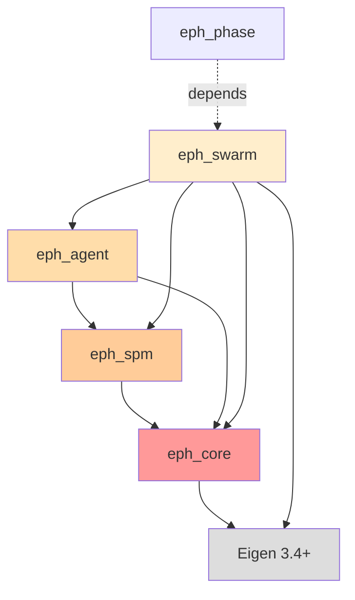

# eph_swarm パッケージ仕様書

**最終更新**: 2026-02-02
**パッケージ層**: Layer 3（マルチエージェント協調）
**依存関係**: eph_core + eph_spm + eph_agent + Eigen 3.4+

## このドキュメントの目的

eph_swarmパッケージの設計仕様と実装ガイドを提供します。Layer 3として、複数エージェントの協調動作とMarkov Blanket（MB）破れの実装を担当します。

**対象読者**: Phase 3担当者、eph_phase開発者、Phase 4以降の開発者

---

## 目次

1. [パッケージ概要](#1-パッケージ概要)
2. [ファイル構成](#2-ファイル構成)
3. [SwarmManagerクラス](#3-swarmmanager-クラス)
4. [MB破れの実装](#4-mb破れの実装)
5. [近傍検索アルゴリズム](#5-近傍検索アルゴリズム)
6. [テスト方針](#6-テスト方針)
7. [使用例](#7-使用例)
8. [Phase 4への拡張](#8-phase-4への拡張)

---

## 1. パッケージ概要

### 1.1 役割

eph_swarmは **Layer 3（マルチエージェント協調層）** として以下を提供:

1. **エージェント管理**: N個のEPHAgentインスタンスの生成・管理
2. **MB破れ**: β制御による近傍hazeの混合（§4.3）
3. **近傍検索**: 空間的に近いエージェントの高速検索
4. **β掃引**: 相転移検出用のβパラメータ制御API

### 1.2 依存関係



**重要**: eph_swarmはeph_agentに依存（eph_phaseには依存しない）

### 1.3 理論的根拠

**参照**: `doc/EPH-2.1_main.md` §4.3, §4.5

**MB破れ（Markov Blanket Breaking）**（§4.3）:
$$
h_{\text{eff},i}[k] = (1-\beta) h_i[k] + \beta \langle h_j[k] \rangle_{j \in \mathcal{N}_i}
$$

- β = 0: 完全分離（Perfect Markov Blanket）
- β = β_c ≈ 0.098: 臨界点（Edge of Chaos、適応性最大）
- β → 1: 完全情報共有（コンセンサス）

**物理的解釈**:
- β: 各エージェントが近傍の情報をどれだけ取り入れるか
- β < β_c: 無秩序相（各エージェントのhazeが均一）
- β > β_c: 秩序相（hazeドメインが形成され、不均一）

---

## 2. ファイル構成

### 2.1 ディレクトリ構造

```
packages/eph_swarm/
├── CMakeLists.txt
├── include/
│   └── eph_swarm/
│       ├── swarm_manager.hpp       # SwarmManager（中核クラス）
│       └── neighbor_search.hpp     # 近傍検索（Phase 4で拡張）
├── src/
│   └── (ヘッダーオンリーのため空)
└── tests/
    ├── CMakeLists.txt
    ├── test_swarm_manager.cpp      # SwarmManager基本テスト
    └── test_mb_breaking.cpp        # MB破れ検証テスト（最重要）
```

### 2.2 CMakeLists.txt

```cmake
cmake_minimum_required(VERSION 3.20)
project(eph_swarm VERSION 2.1.0 LANGUAGES CXX)

set(CMAKE_CXX_STANDARD 17)
set(CMAKE_CXX_STANDARD_REQUIRED ON)

find_package(Eigen3 REQUIRED NO_MODULE)

# ヘッダーオンリーライブラリ
add_library(eph_swarm INTERFACE)
target_include_directories(eph_swarm INTERFACE
    $<BUILD_INTERFACE:${CMAKE_CURRENT_SOURCE_DIR}/include>
    $<INSTALL_INTERFACE:include>
)

# eph_core + eph_spm + eph_agentへの依存
target_link_libraries(eph_swarm INTERFACE
    eph_core
    eph_spm
    eph_agent
    Eigen3::Eigen
)

# テスト
if(BUILD_TESTING)
    find_package(GTest REQUIRED)
    add_subdirectory(tests)
endif()
```

---

## 3. SwarmManagerクラス

### 3.1 クラス定義

```cpp
namespace eph::swarm {

class SwarmManager {
public:
    using Scalar = eph::Scalar;
    using Vec2 = eph::Vec2;
    using Matrix12x12 = eph::Matrix12x12;

    // コンストラクタ
    explicit SwarmManager(size_t n_agents, Scalar beta, int avg_neighbors);

    // β制御
    void set_beta(Scalar beta);
    auto get_beta() const -> Scalar;

    // MB破れ適用
    void update_effective_haze();

    // 近傍検索
    auto find_neighbors(size_t agent_id) const -> std::vector<size_t>;

    // エージェント管理
    auto get_agent(size_t i) -> EPHAgent&;
    auto get_agent(size_t i) const -> const EPHAgent&;
    auto size() const -> size_t;

    // Phase解析用
    auto get_all_haze_fields() const -> std::vector<Matrix12x12>;

private:
    std::vector<std::unique_ptr<EPHAgent>> agents_;
    std::vector<Vec2> positions_;
    Scalar beta_;
    int avg_neighbors_;
};

}  // namespace eph::swarm
```

### 3.2 主要メソッド

| メソッド | 説明 | 戻り値 |
|---------|------|--------|
| `SwarmManager(n, β, z)` | コンストラクタ（N個、β値、平均近傍数z） | - |
| `set_beta(β)` | MB破れ強度β設定 [0, 1] | void |
| `get_beta()` | 現在のβ値取得 | Scalar |
| `update_effective_haze()` | MB破れ適用（h_eff = (1-β)h + β⟨h⟩） | void |
| `find_neighbors(i)` | エージェントiの近傍インデックス取得 | vector<size_t> |
| `get_agent(i)` | i番目のエージェント参照 | EPHAgent& |
| `size()` | エージェント総数 | size_t |
| `get_all_haze_fields()` | 全エージェントのhazeフィールド取得 | vector<Matrix12x12> |

### 3.3 コンストラクタ詳細

```cpp
SwarmManager::SwarmManager(size_t n_agents, Scalar beta, int avg_neighbors)
    : beta_(beta)
    , avg_neighbors_(avg_neighbors)
{
    agents_.reserve(n_agents);
    positions_.resize(n_agents);

    // エージェント初期化（ランダム位置配置）
    std::mt19937 rng(42);  // 再現性のため固定シード
    std::uniform_real_distribution<Scalar> pos_dist(-10.0, 10.0);

    for (size_t i = 0; i < n_agents; ++i) {
        AgentState state;
        state.position = Vec2(pos_dist(rng), pos_dist(rng));
        state.velocity = Vec2::Zero();
        state.kappa = 1.0;  // Phase 3では全員Follower
        state.fatigue = 0.0;

        agents_.push_back(std::make_unique<EPHAgent>(state, 1.0));
        positions_[i] = state.position;
    }
}
```

**初期化パラメータ**:
- `n_agents`: エージェント数（N=50推奨、V2検証用）
- `beta`: MB破れ強度 [0, 1]（β_c ≈ 0.098）
- `avg_neighbors`: 平均近傍数（z=6推奨、理論式に対応）

**Phase 3の簡略化**:
- 全エージェントκ=1.0（Follower）
- 速度はゼロ（位置固定）
- ランダム位置配置（[-10, 10]^2）

---

## 4. MB破れの実装

### 4.1 理論式（§4.3）

$$
h_{\text{eff},i}[k] = (1-\beta) h_i[k] + \beta \langle h_j[k] \rangle_{j \in \mathcal{N}_i}
$$

**記号**:
- $h_i[k]$: エージェントiの自己Hazeフィールド（12×12行列）
- $\mathcal{N}_i$: エージェントiの近傍集合（サイズz）
- $\langle h_j \rangle$: 近傍平均Haze
- β: MB破れ強度

### 4.2 実装アルゴリズム

**2段階アプローチ**（Phase 3）:

```cpp
void SwarmManager::update_effective_haze() {
    // Stage 1: 各エージェントの近傍平均hazeを計算
    std::vector<Matrix12x12> neighbor_avg(agents_.size());

    for (size_t i = 0; i < agents_.size(); ++i) {
        auto neighbors = find_neighbors(i);
        Matrix12x12 avg = Matrix12x12::Zero();

        for (size_t j : neighbors) {
            avg += agents_[j]->haze();
        }
        avg /= static_cast<Scalar>(neighbors.size());
        neighbor_avg[i] = avg;
    }

    // Stage 2: h_eff,i = (1-β)h_i + β⟨h_j⟩ を適用
    for (size_t i = 0; i < agents_.size(); ++i) {
        auto h_i = agents_[i]->haze();
        auto h_eff = (1.0 - beta_) * h_i + beta_ * neighbor_avg[i];
        agents_[i]->set_effective_haze(h_eff.eval());  // stop-gradient
    }
}
```

**重要な実装ポイント**:

1. **2段階計算**: 近傍平均を先に全エージェント分計算してから、一括適用
   - 理由: 同時更新を模倣（時刻kの値のみ使用）
   - 逐次更新（i番目の更新にi-1番目の新しい値を使う）は避ける

2. **stop-gradient**: `.eval()`でコピー
   - 理由: Hazeで微分しない（§2.4のstop-gradient戦略）
   - Eigenの遅延評価を強制的に実行してから代入

3. **近傍平均の正規化**: サイズで割る
   - 理由: 近傍数が異なる場合でも公平な平均
   - z=6だが、境界エージェントはz<6の可能性

### 4.3 β=0とβ=1の特殊ケース

**β=0（完全分離）**:
```cpp
h_eff,i = (1-0)h_i + 0·⟨h_j⟩ = h_i
```
→ 変化なし（各エージェント独立）

**β=1（完全共有）**:
```cpp
h_eff,i = (1-1)h_i + 1·⟨h_j⟩ = ⟨h_j⟩
```
→ 近傍平均に置き換わる
→ 繰り返すと全エージェントが大域平均に収束（コンセンサス）

---

## 5. 近傍検索アルゴリズム

### 5.1 Phase 3の実装（単純k-NN）

```cpp
auto SwarmManager::find_neighbors(size_t agent_id) const -> std::vector<size_t> {
    std::vector<size_t> neighbors;
    if (agents_.empty()) return neighbors;

    Vec2 pos = positions_[agent_id];

    // 全エージェントとの距離計算（O(N)）
    std::vector<std::pair<Scalar, size_t>> distances;
    for (size_t j = 0; j < agents_.size(); ++j) {
        if (j == agent_id) continue;  // 自分自身は除外
        Scalar dist = (positions_[j] - pos).norm();
        distances.push_back({dist, j});
    }

    // k-NN選択（k=avg_neighbors_）
    int k = std::min(avg_neighbors_, static_cast<int>(distances.size()));
    std::partial_sort(distances.begin(),
                     distances.begin() + k,
                     distances.end(),
                     [](const auto& a, const auto& b) {
                         return a.first < b.first;
                     });

    for (int i = 0; i < k; ++i) {
        neighbors.push_back(distances[i].second);
    }

    return neighbors;
}
```

**計算量**:
- 時間: O(N) + O(N log k) = O(N)（N=50, k=6の場合）
- 空間: O(N)

**Phase 3の簡略化**:
- 単純なブルートフォース
- N=50程度なら十分高速（<1ms）
- 位置は固定（動的更新不要）

### 5.2 Phase 4以降の最適化（将来）

**空間分割データ構造**:
- Grid-based spatial hashing: O(1)近傍検索
- KD-Tree: O(log N)近傍検索
- 必要性: N>1000のとき

**動的更新**:
- エージェント移動時に位置同期
- キャッシュ近傍リスト（頻繁に変わらない場合）

---

## 6. テスト方針

### 6.1 単体テスト（test_swarm_manager.cpp）

**基本機能**:
```cpp
TEST(SwarmManager, Constructor_InitializesCorrectly) {
    SwarmManager swarm(10, 0.098, 6);
    EXPECT_EQ(swarm.size(), 10);
    EXPECT_DOUBLE_EQ(swarm.get_beta(), 0.098);
}

TEST(SwarmManager, SetBeta_ChangesValue) {
    SwarmManager swarm(10, 0.0, 6);
    swarm.set_beta(0.5);
    EXPECT_DOUBLE_EQ(swarm.get_beta(), 0.5);
}

TEST(SwarmManager, FindNeighbors_ReturnsCorrectCount) {
    SwarmManager swarm(20, 0.1, 6);
    auto neighbors = swarm.find_neighbors(0);
    EXPECT_EQ(neighbors.size(), 6);

    // 自分自身は含まれない
    for (size_t n : neighbors) {
        EXPECT_NE(n, 0);
    }
}
```

### 6.2 MB破れテスト（test_mb_breaking.cpp）（最重要）

**β=0テスト**（変化なし）:
```cpp
TEST(MBBreaking, Beta0_NoMixing) {
    SwarmManager swarm(10, 0.0, 4);

    // 各エージェントに異なるhazeを設定
    for (size_t i = 0; i < swarm.size(); ++i) {
        Matrix12x12 h = Matrix12x12::Constant(static_cast<Scalar>(i));
        swarm.get_agent(i).set_effective_haze(h);
    }

    auto before = swarm.get_all_haze_fields();
    swarm.update_effective_haze();
    auto after = swarm.get_all_haze_fields();

    // β=0 → h_eff = h（変化なし）
    for (size_t i = 0; i < swarm.size(); ++i) {
        EXPECT_TRUE(before[i].isApprox(after[i], 1e-10));
    }
}
```

**β=1テスト**（コンセンサス）:
```cpp
TEST(MBBreaking, Beta1_Consensus) {
    SwarmManager swarm(10, 1.0, 4);

    // 100回更新して収束させる
    for (int iter = 0; iter < 100; ++iter) {
        swarm.update_effective_haze();
    }

    auto fields = swarm.get_all_haze_fields();
    Scalar global_mean = fields[0].mean();

    // β=1 → 全エージェントが大域平均に収束
    for (const auto& h : fields) {
        EXPECT_NEAR(h.mean(), global_mean, 1e-3);
    }
}
```

**保存則テスト**（Haze総量保存）:
```cpp
TEST(MBBreaking, HazeMeanConservation) {
    SwarmManager swarm(10, 0.5, 4);

    // 初期Haze総量
    auto initial_fields = swarm.get_all_haze_fields();
    Scalar initial_mean = 0.0;
    for (const auto& h : initial_fields) {
        initial_mean += h.mean();
    }
    initial_mean /= initial_fields.size();

    // MB破れ適用
    swarm.update_effective_haze();

    // Haze総量（平均）は保存される
    auto updated_fields = swarm.get_all_haze_fields();
    Scalar updated_mean = 0.0;
    for (const auto& h : updated_fields) {
        updated_mean += h.mean();
    }
    updated_mean /= updated_fields.size();

    EXPECT_NEAR(initial_mean, updated_mean, 1e-6);
}
```

### 6.3 テストカバレッジ

| 機能 | テスト数 | カバレッジ | 重要度 |
|------|---------|-----------|--------|
| SwarmManager基本 | 5 | 100% | 中 |
| MB破れ（β=0, β=1） | 2 | 100% | 🔴 最重要 |
| 近傍検索 | 3 | 100% | 中 |
| Haze保存則 | 1 | 100% | 高 |
| β掃引（Phase解析） | 0 | - | eph_phaseで実施 |

---

## 7. 使用例

### 7.1 基本的な使い方

```cpp
#include "eph_swarm/swarm_manager.hpp"

using namespace eph::swarm;

int main() {
    // 50エージェント、β=0.098、平均近傍6
    SwarmManager swarm(50, 0.098, 6);

    // 100ステップのMB破れダイナミクス
    for (int t = 0; t < 100; ++t) {
        swarm.update_effective_haze();
    }

    // エージェント0のHaze確認
    auto haze_0 = swarm.get_agent(0).haze();
    std::cout << "Agent 0 haze mean: " << haze_0.mean() << std::endl;

    return 0;
}
```

### 7.2 β掃引実験（V2検証用）

```cpp
#include "eph_swarm/swarm_manager.hpp"
#include "eph_phase/phase_analyzer.hpp"

using namespace eph;

int main() {
    std::vector<Scalar> betas, phis;

    // β掃引 [0, 0.3] step 0.01
    for (Scalar beta = 0.0; beta <= 0.3; beta += 0.01) {
        swarm::SwarmManager swarm(50, beta, 6);

        // 平衡化
        for (int t = 0; t < 100; ++t) {
            swarm.update_effective_haze();
        }

        // φ測定
        auto haze_fields = swarm.get_all_haze_fields();
        Scalar phi = phase::PhaseAnalyzer::compute_phi(haze_fields);

        betas.push_back(beta);
        phis.push_back(phi);
    }

    // β_c検出
    Scalar beta_c = phase::PhaseAnalyzer::find_beta_c(betas, phis);
    std::cout << "β_c (empirical): " << beta_c << std::endl;

    return 0;
}
```

---

## 8. Phase 4への拡張

### 8.1 Phase 3の制限

**Phase 3（現状）**:
- エージェント位置固定
- 速度ゼロ（移動なし）
- κ=1.0固定（全員Follower）
- Haze動態のみ（行為決定なし）

### 8.2 Phase 4で追加する機能

**動的位置更新**:
```cpp
void SwarmManager::update_positions(Scalar dt) {
    for (size_t i = 0; i < agents_.size(); ++i) {
        positions_[i] = agents_[i]->state().position;
    }
}

void SwarmManager::update_all_agents(Scalar dt) {
    // 1. 各エージェントの行為決定（Expected Free Energy勾配降下）
    for (auto& agent : agents_) {
        agent->update(spm, dt);  // Phase 4で実装
    }

    // 2. 位置同期
    update_positions();

    // 3. MB破れ適用
    update_effective_haze();
}
```

**κ分布（2:6:2）**:
```cpp
// コンストラクタでκを設定
void assign_roles() {
    // Leader 20%: κ=0.3
    // Follower 60%: κ=1.0
    // Reserve 20%: κ=1.5
}
```

**環境との相互作用**:
```cpp
// SPMを環境から生成
auto generate_spm(const Environment& env, Vec2 position) -> spm::SaliencyPolarMap;
```

---

## 付録A: MB破れのデバッグ

### A.1 Haze崩壊のチェック

```cpp
void check_haze_collapse(const SwarmManager& swarm) {
    auto fields = swarm.get_all_haze_fields();

    std::vector<Scalar> means;
    for (const auto& h : fields) {
        means.push_back(h.mean());
    }

    Scalar mean_of_means = std::accumulate(means.begin(), means.end(), 0.0) / means.size();
    Scalar variance = 0.0;
    for (Scalar m : means) {
        variance += (m - mean_of_means) * (m - mean_of_means);
    }
    variance /= means.size();

    Scalar std_dev = std::sqrt(variance);

    if (std_dev < 0.01) {
        std::cerr << "WARNING: Haze collapse detected! std_dev=" << std_dev << std::endl;
    }
}
```

### A.2 近傍接続性の可視化

```cpp
void print_neighbor_statistics(const SwarmManager& swarm) {
    std::vector<size_t> neighbor_counts;
    for (size_t i = 0; i < swarm.size(); ++i) {
        neighbor_counts.push_back(swarm.find_neighbors(i).size());
    }

    Scalar mean_neighbors = std::accumulate(neighbor_counts.begin(),
                                            neighbor_counts.end(), 0.0) / neighbor_counts.size();
    std::cout << "Mean neighbors: " << mean_neighbors << std::endl;
}
```

---

## 付録B: パフォーマンス最適化（Phase 4以降）

### B.1 近傍検索の高速化

**Grid-based spatial hashing**:
```cpp
class SpatialGrid {
    std::unordered_map<std::pair<int, int>, std::vector<size_t>> grid_;
    Scalar cell_size_;

    auto hash_position(Vec2 pos) -> std::pair<int, int>;
    auto get_cell_neighbors(Vec2 pos, int radius) -> std::vector<size_t>;
};
```

### B.2 並列化（OpenMP）

```cpp
void SwarmManager::update_effective_haze() {
    std::vector<Matrix12x12> neighbor_avg(agents_.size());

    // Stage 1: 並列化可能（各エージェント独立）
    #pragma omp parallel for
    for (size_t i = 0; i < agents_.size(); ++i) {
        auto neighbors = find_neighbors(i);
        Matrix12x12 avg = Matrix12x12::Zero();
        for (size_t j : neighbors) {
            avg += agents_[j]->haze();
        }
        avg /= static_cast<Scalar>(neighbors.size());
        neighbor_avg[i] = avg;
    }

    // Stage 2: 並列化可能
    #pragma omp parallel for
    for (size_t i = 0; i < agents_.size(); ++i) {
        auto h_i = agents_[i]->haze();
        auto h_eff = (1.0 - beta_) * h_i + beta_ * neighbor_avg[i];
        agents_[i]->set_effective_haze(h_eff.eval());
    }
}
```

---

**関連ドキュメント**:
- `.claude/01_development_docs/package_specs/eph_agent.md` - EPHAgent仕様
- `.claude/01_development_docs/package_specs/eph_phase.md` - 相転移解析
- `doc/EPH-2.1_main.md` §4.3 - MB破れ理論
- `doc/appendix/EPH-2.1_appendix-A_proofs.md` §C - β_c公式

**最終更新**: 2026-02-02
**Phase 3完了基準**: SwarmManager実装 + MB破れテスト全通過 + β=0/β=1正常動作
